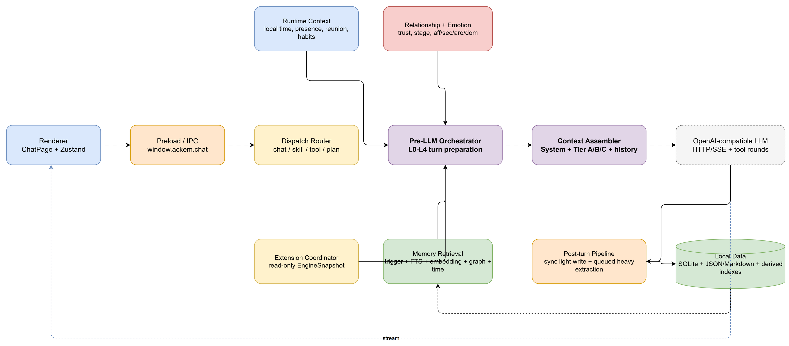
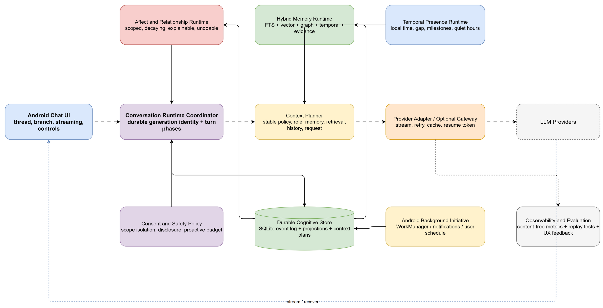

# Ackem 深度研究与 Pixory AI 聊天体验演进报告

> 研究对象：`D:\Project\pixory_research\projects\Ackem`
> 对照项目：`D:\Project\Pixory\pixory`
> 研究日期：2026-07-28
> Ackem 基线：`daf5ce0164f83310dcb44a79ec9386d2dac398ca`（2026-07-05）
> 方法：本地源码静态审阅、调用链追踪、数据模型核对、文档交叉验证、反例审查
> 结论适用方向：Android-first，但不把 Pixory 现有约束当作不可挑战的硬边界

## 1. 执行摘要

Ackem 最值得研究的不是 Electron 外壳，也不是某个单独提示词，而是它建立了一套相对完整的“陪伴认知运行时”：用户输入先经过事件解释，随后更新关系与情绪，调用多路记忆检索，生成心理与节奏控制信号，再把稳定人格、动态记忆、时间信息、显式文档和最近历史组装为模型上下文；模型回复后，系统同步写轻量记忆，并把事实、情节、三元组、关联和归档交给异步任务处理。[证据：Ackem `src/main/engine/orchestrator.ts:212-247,378-385,451-507,1352-1539`；`src/main/context.ts:184-256`；`src/main/postChatTurn.ts:72-199`]

这一思路对 Pixory 很有价值，但不能把 Ackem 当作可以直接移植的成熟实现。Ackem 当前存在非原子两阶段回合、仅内存 PendingTurn、仅内存记忆任务队列、会话/隐私作用域不完整、聊天记录 blob 化、普通聊天不可恢复、扩展边界实际越界、测试入口与文档不一致等问题。[证据：Ackem `src/main/ipc/chat.ts:653-657,778-789`；`src/main/turnPending.ts:18-37`；`src/main/memory/memoryWriteJob.ts:26-35,222-233`；`src/main/db/schemaV1.ts:16-20`；`package.json:8-24`]

Pixory 也并非全面落后。它在多 Provider、角色卡快照、消息版本、分支路线、流式 stop/continue、generationId 隔离、Android 页面切换后的流订阅、normal/personal 双数据库、SecureStore、记忆事件账本、可重建投影和连续性导入方面明显更扎实。[证据：Pixory `src/ai/aiChatService.ts:3377-3405,4459-4514,4573-5111`；`src/database/schema.ts:1039-1387`；`src/database/db.ts:59-80`；`src/ai/secureAiSettingsService.ts:27-90`]

Pixory 真正缺少的不是更多聊天按钮，而是五个系统级闭环：

1. **记忆正确性闭环**：稳定记忆治理、分支记忆隔离、真正的记忆向量任务、统一检索入口。
2. **情感与关系运行时**：当前只有少量正则驱动的 affinity/trust/tension/familiarity 弱信号，还不是连续、可解释、可撤销的 affect system。
3. **时间与存在感**：缺少本地时间、离线间隔、纪念日、上次未完话题和主动回忆的统一上下文层。
4. **进程死亡后的生成恢复**：当前能保存 partial text，但 Android 进程重启只会把 generating 改成 stopped，不会恢复远端生成。
5. **主动陪伴与通知治理**：缺少 Android 原生持久调度、安静时段、每日预算、Personal 隐私策略和“为何收到这条”的用户控制。

建议的总体方向是：保留 Pixory 的消息/分支/隐私/流式基础设施，吸收 Ackem 的认知分层思想，重构成数据库驱动、作用域严格、Android 可恢复、用户可解释的 `Conversation Runtime`。不建议复制 Ackem 的桌面常驻定时器、惩罚式关系模型、默认主动“骚扰”、秘密心理画像或“AI 必须宣称自己有真实身体”的欺骗式拟人化。[证据：Ackem `src/main/prompt/main-chat.ts:9-21`；`src/main/engine/reunion.ts:35`；`src/main/extensions/plugins/builtin/desktop-companion/companionHarassScheduler.ts:82-159`]

## 2. 研究问题、范围与证据标准

### 2.1 研究问题

本报告回答五个问题：

1. Ackem 的实际运行架构和端到端聊天链路是什么？
2. 它的记忆、上下文、情感、关系、时间与主动陪伴系统如何读写和协同？
3. 哪些设计已经进入默认运行链路，哪些只是接口、实验或占位？
4. Pixory 当前已经具备什么，最重要的缺口是什么？
5. 在 Android-first 前提下，哪些机制可直接吸收，哪些必须重构，哪些应明确拒绝？

### 2.2 证据等级

| 等级 | 定义 | 本报告用法 |
| --- | --- | --- |
| A | 源码调用链、SQL schema、测试实际覆盖 | 可作为实现事实 |
| B | 与源码大体一致的开发文档、README | 用于解释设计意图 |
| C | 文件存在、类型存在、接口存在，但未找到运行调用点 | 只能认定为“部分/计划/实验” |
| D | 根据结构做出的工程推断 | 明确标为推断或建议 |

特别规则：代码中存在某个类、字段或提示词，不等于它已成为成熟产品能力；文档声称“已支持”，也必须由调用链或测试复核。

### 2.3 研究限制

- Ackem 工作树干净，但没有 `node_modules`，本轮未安装依赖、未启动应用、未运行其 TypeScript 或 UI 测试。
- Ackem 仅发现 4 个正式 `*.test.ts`，且 `package.json` 没有 README 所描述的 `npm test` script，因此成熟度判断主要来自静态取证。[证据：Ackem `package.json:8-24,60`；`README.zh.md:18,187-190`]
- Pixory 的大量 policy tests 是读取源码后做正则断言，适合防止结构回退，但不能代替真实 Android 进程终止、Provider SSE、备份恢复和低端机长聊测试。[证据：Pixory `docs/product-capability-baseline.md:120-127`]
- 本报告不是法律意见。Ackem 使用 AGPL-3.0；Pixory 若直接复制实现代码并进行闭源分发或提供网络服务，应先完成许可证评估或取得商业授权。借鉴架构思想与独立实现不等于复制代码。[证据：Ackem `LICENSE:4-12,18-30`；`NOTICE.md:3-14,71-74`]

## 3. Ackem 项目与总体架构

### 3.1 技术形态

Ackem 是本地优先的 Windows Electron 应用：Renderer 使用 React 18，状态层使用 Zustand；Main Process 负责窗口、IPC、SQLite、Embedding、模型调用、扩展、桌面能力和语音子进程；Preload 暴露有限的 `window.ackem.*` API。[证据：Ackem `package.json:26-60`；`src/main/mainApp.ts:50-64`；`src/preload/index.ts:174-201,509-605`]

主数据存储使用 `better-sqlite3`，并同时保留 JSON/Markdown 兼容副本与可重建派生索引。SQLite 使用 WAL 和 `synchronous=NORMAL`。[证据：Ackem `src/main/db/database.ts:20-36,89-109`；`docs/developer/architecture/07-data-layer.zh.md:390-426`]

### 3.2 架构图



可编辑源图：`docs/ai-chat-research/ackem-chat-runtime-architecture.drawio`

### 3.3 分层职责

| 层 | 主要模块 | 实际职责 | 评价 |
| --- | --- | --- | --- |
| Renderer | `ChatPage`, `chatSend`, Zustand store | 输入、乐观行、流事件、聊天 UI | UI 与生命周期绑定较深 |
| Preload/IPC | `preload/index.ts`, `ipc/*.ts` | 限定 API、参数跨进程传递 | 边界清晰，但 settings 会回到 Renderer |
| Dispatch | `extensions/dispatch/*` | chat/tool/skill/plan/surface 分流 | 能力广，但内置扩展越界依赖核心 |
| Brain/Heart | `engine/*` | 输入解释、关系、情绪、心理、节奏、涌现 | 是 Ackem 最有研究价值的部分 |
| Memory | `memory/*` | 事实、情节、图、检索、整合、时间锚点 | 机制丰富，作用域治理不足 |
| Mouth/Context | `prompt/*`, `context.ts` | 组装 system、Tier A/B/C、历史 | 分层清晰，但资料信任边界偏弱 |
| Provider | `chat.ts`, `anthropicMessages.ts` | OpenAI-compatible / Anthropic 流式调用 | 适配范围有限，缺 provider routing |
| Post-turn | `postChatTurn.ts`, `memoryWriteJob.ts` | 同步轻写、异步深提取、TTS | 思路正确，任务不持久 |
| Data | `db/*`, JSON/Markdown | 状态、历史、记忆、trace、扩展 | 双写兼容增加一致性成本 |

### 3.4 一轮对话的精确生命周期

1. Renderer 校验设置、年龄、Embedding readiness 和 busy 状态，解析显式附件，并乐观插入用户消息与空 assistant 行。[证据：Ackem `src/renderer/src/lib/chatSend.ts:43-82,92-108`]
2. Renderer 调用 `context:build`；Main 加载 settings、dataRoot、索引、会话状态、Embedding、MemoryRetriever 和扩展快照。[证据：Ackem `src/main/ipc/chat.ts:151-224`]
3. `prepareTurnContext` 并行计算当前 query embedding 与最近三条用户消息的 conversation embedding，然后带时间、情绪和 session 参数进行记忆检索。[证据：Ackem `src/main/engine/prepareTurnContext.ts:51-118`]
4. Dispatch 与 pre-LLM 部分并行。某些 skill/plan/surface 路径可直接跳过普通模型聊天。[证据：Ackem `src/main/ipc/chat.ts:303-582`]
5. `runPreLlmTurn` 解释输入，更新关系与情绪，应用记忆回声、重逢、时间偏置与扩展情绪，计算欲望、涌现、节奏和主动主题，输出 `newState`、`tierBBlock`、`psycheBlock` 和 trace。[证据：Ackem `src/main/engine/orchestrator.ts:360-575,773-900,1003-1183,1352-1539`]
6. Main 在真正模型调用前已经更新 working memory，并把 PendingTurn 放入内存 Map。[证据：Ackem `src/main/ipc/chat.ts:653-657,778-789`；`src/main/turnPending.ts:18-37`]
7. `assembleMessages` 组装单个大 system message，附最近 20 条消息和当前 user message。[证据：Ackem `src/main/context.ts:241-256`]
8. Context 返回 Renderer，Renderer 再发起 `chat:start`；Main 选择 OpenAI-compatible、Anthropic 或 Wave 路径并开始 SSE。[证据：Ackem `src/renderer/src/components/ChatPage.tsx:517-532,823`；`src/main/ipc/chat.ts:898-917`]
9. Renderer 持续 patch assistant 占位行；只有 `chat:done` 后才保存完整 chatRows。[证据：Ackem `src/main/chat.ts:839-850`；`src/renderer/src/components/ChatPage.tsx:477-495`]
10. Post-turn 同步保存状态、轻量事实、回复日志和关联反馈，随后按 session 串行执行事实/情节/图谱提取、遗忘与反复表达抑制。[证据：Ackem `src/main/postChatTurn.ts:95-199`；`src/main/memory/memoryWriteJob.ts:26-35,37-145`]

这一链路的核心优点是阶段清楚；核心缺陷是“准备回合”和“执行生成”不是一个可恢复事务。若 Renderer 在两次 IPC 之间崩溃，关系/情绪可能已经改变，但用户并未得到回复。

## 4. Ackem 记忆系统

### 4.1 数据模型

Ackem 的记忆不是单一摘要，而是多类结构化对象：

| 对象 | 关键字段/用途 | 证据 |
| --- | --- | --- |
| `memory_facts` | domain、subcategory、subject、summary、weight、confidence、status、trigger、情绪、session、layer、tier、sensitivity、privacy | `src/main/engine/types.ts:342-377`; `schemaV1.ts:22-46`; `schemaV4.ts:36-37`; `schemaV10.ts:3-4` |
| `episodes` | 会话级叙事片段、情绪、来源轮次 | `schemaV1.ts:48-60`; `types.ts:389-408` |
| `knowledge_triples` | subject-predicate-object 及 confidence | `schemaV2.ts:3-13`; `types.ts:410-418` |
| `memory_associations` | fact-to-fact、强度、关联类型 | `schemaV4.ts:6-19` |
| `temporal_anchors` | 日期/周期/事件与 fact 的连接 | `schemaV4.ts:21-34` |
| `procedural_habits`, `user_habits` | 程序性与时段习惯 | `schemaV1.ts:62-68`; `schemaV6.ts:6-27` |
| `fact_embeddings` | 模型签名、维度与向量 | `schemaV8.ts:3-11` |

事实对象还区分 `raw/consolidated`、`core/archival`、`active/retired`，并以不同 decay 参数参与评分。[证据：Ackem `src/main/engine/types.ts:342-372`；`src/main/memory/factStore.ts:244-276`；`src/main/engine/ackemParams.ts:87,93-94,167`]

### 4.2 写路径

Ackem 使用“同步轻抽取 + 异步深抽取”双通道：

- 回答完成后立即写规则事实、情绪上下文、时间锚点和 companion reply log。[证据：Ackem `src/main/postChatTurn.ts:140-176`]
- 后台任务使用 LLM 抽取事实和情节，规则生成三元组，执行相似事实查找、矛盾判断、关联冷启动、自动退休、归档和高层整合。[证据：Ackem `src/main/memory/ingest.ts:88-215,231-336`]
- 同一 session 的后台任务用 Promise chain 串行，避免回合乱序。[证据：Ackem `src/main/memory/memoryWriteJob.ts:26-35,223-233`]
- 显式“记住/纠正/忘记”可走本地规则快路径，减少对远端模型依赖。[证据：Ackem `src/main/memory/lightExtract/index.ts:11`；`src/main/postChatTurn.ts:123-128`]

这个模式非常适合 Pixory：首 token 和最终回复不必等待重维护，同时显式用户指令可以确定性落地。需要改的是任务持久化和作用域，而不是模式本身。

### 4.3 读路径

`MemoryRetriever` 会组合多路候选：触发词、SQLite FTS5、Jaccard/TF-IDF、Embedding、时间语义、时间锚点、关联扩散、知识图谱、文档 chunk 和 episode。候选再按衰减、权重、置信度、当前情绪、时效和命中类型重新评分，最后在字符预算内构建 Tier B。[证据：Ackem `src/main/memory/retriever.ts:58-174,218-417,426-539`]

Embedding 不可用时，系统回退到 FTS 与词面搜索；检索失败通常静默降级，不阻塞聊天。[证据：Ackem `src/main/memory/retriever.ts:97-128`；`docs/ai-context-and-retrieval-policy.zh.md:131-141`]

### 4.4 值得迁移的机制

1. **多路召回，而非单一向量 top-k。** 关键词、时间、图关系、episode 分别解决不同类型的“想起来”。
2. **记忆回声。** 被召回记忆不仅提供事实，也可以向本轮 affect plan 提供弱情绪信号。[证据：Ackem `src/main/engine/orchestrator.ts:500-507`]
3. **时间锚点。** “去年这时”“生日”“第一次见面”等不依赖纯语义相似度。[证据：Ackem `src/main/memory/retriever.ts:135-174,218-308`]
4. **关联冷启动和共现强化。** 新事实建立初始边，后续共同召回时加强联系。[证据：Ackem `src/main/memory/ingest.ts:215-270`; `retriever.ts:312-385`]
5. **核心记忆预留预算。** 重要身份/边界不应被普通历史挤掉。[证据：Ackem `src/main/engine/ackemParams.ts:167`; `retriever.ts:426-474`]
6. **可编辑、可退休、可反馈。** 用户能纠正系统，而不是只能接受自动记忆。[证据：Ackem `src/main/ipc/memory.ts:43-103`]

### 4.5 不可忽视的问题

| 问题 | 后果 | 证据 |
| --- | --- | --- |
| 相似事实去重未强制 sourceSession 一致 | 不同会话可能互相合并 | `src/main/memory/factStore.ts:413` |
| 核心事实、KG、chunk 的会话/隐私过滤不一致 | 跨会话或成人事实可能错误注入 | `retriever.ts:437,476,489` |
| consolidator 读取全局 active facts | 高层总结可能把其他会话内容带入当前会话 | `consolidator.ts:41-80` |
| 主动遗忘依赖 embedding 且未按会话过滤 | 无 embedding 时失效，并可能误伤其他会话 | `memoryWriteJob.ts:147-180` |
| 矛盾 prompt 与 parser 枚举不一致 | 判断可能退化为 unrelated | `prompt/memory-contradiction.ts:9`; `contradictionDetector.ts:117` |
| 任务队列只在内存 | 退出/崩溃时丢深提取 | `memoryWriteJob.ts:222-237` |
| 删除 session 未清理全部关联数据 | 隐私删除不完整 | `ipc/session.ts:53` |

因此，Pixory 只能迁移“多路、分层、可解释”的思想，不能复制 Ackem 的全局作用域做法。

## 5. Ackem 上下文系统

### 5.1 Tier 结构

Ackem 的上下文可概括为：

```text
稳定主提示 / Canon
  + Tier A：伴侣快照、关系与当前状态
  + 用户档案 / psyche / 时间与节奏信号
  + Tier B：本轮检索到的事实、情节、图与文档片段
  + Tier C：用户显式指定文档
  + Extension injection
  + 最近 20 条消息
  + 当前用户请求
```

实际拼接顺序见 `src/main/context.ts:184-256`；Tier A 从 companion 文件读取，Tier B 来自引擎或 index，Tier C 必须通过 dataRoot 白名单路径检查。[证据：Ackem `src/main/context.ts:74-120,167-178,200-231`]

### 5.2 优点

- 稳定人格、动态记忆与显式资料分开，利于预算和调试。
- `prepareTurnContext` 复用 embedding/retrieval 结果，避免 dispatch 和 orchestrator 重算。[证据：Ackem `src/main/engine/prepareTurnContext.ts:14-118`; `orchestrator.ts:238-250`]
- 为 working memory 预留空间，Tier B 有最大字符预算和最低置信度。[证据：Ackem `src/main/engine/orchestrator.ts:283-285`; `ackemParams.ts:93-94`]
- 特殊日期、欲望、情感涌现和主动回忆通过话题槽竞争，避免一轮塞入多个主动主题。[证据：Ackem `src/main/engine/orchestrator.ts:1062-1183,1481`]
- Wave 实验尝试在第一波先响应、后续波再补充记忆，但该功能默认被强制关闭，不能认定为成熟能力。[证据：Ackem `src/main/chat/buildWaveMessages.ts:97-126`; `src/main/settings.ts:134-144`]

### 5.3 风险

- 预算主要按字符而非真实模型 token；最近历史固定 20 条，不能适配不同模型窗口。[证据：Ackem `src/main/context.ts:176-178,252`]
- 检索资料被放进 system content，缺少 Pixory 现有 `[MEMORY]` contract 那样明确的“资料不是指令”边界，存在 RAG prompt injection 风险。
- Tier A 固定读取默认 companion state 路径，而非完整按 session 解析，多会话状态可能错配。[证据：Ackem `src/main/context.ts:74-84`; `src/main/engine/state-persistence.ts:70-74`]
- 角色、心理、成人内容、用户画像和资料全部进入一个大 system 字符串，来源与信任等级在最终 payload 中丢失，不利于审计和精细裁剪。

Pixory 应进一步走向“Typed Context Plan”：每个段落必须带 `source/scope/lineage/trust/priority/tokenCost/cacheability/sensitivity/provenance`，而不是只在字符串标题中表达层级。

## 6. Ackem 情感、关系与表达系统

### 6.1 L0-L3 状态链

Ackem 把陪伴状态分为连续层：

| 层 | 状态 | 作用 |
| --- | --- | --- |
| L0 | 输入事件 type、intensity、sincerity | 判断 praise/apology/vulnerable/cold/hurtful 等 |
| L1 | stage、trust、rifts、momentum、atmosphere | 表示关系演化与当前互动气氛 |
| L2 | affection/security/arousal/dominance | 连续情绪状态与衰减 |
| L3 | psyche、expression、rhythm、emergence、desire | 决定语气、长度、距离、主动话题和分气泡节奏 |

核心类型见 `src/main/engine/types.ts:1-72,145-240`。

### 6.2 关系状态机

关系阶段为 `STRANGER/FAMILIAR/INTIMATE`。正向轮次使陌生进入熟悉；高信任与共享事件使熟悉进入亲密；裂痕或低信任可降级；道歉在低信任时触发破冰。[证据：Ackem `src/main/engine/relationship.ts:101-188`; `src/main/engine/ackemParams.ts:39-53,231-235`]

这比“每轮让 LLM 自己猜关系”更稳定，但其数值不应直接成为产品奖励。关系状态应服务于边界、语气与连续性，而不是制造用户必须维护的分数。

### 6.3 四维情绪

输入事件先映射基础刺激，再由 trust、stage、intensity、sincerity、rift 和 atmosphere 调制；随后执行限幅、衰减、锁定与可复现噪声，得到新的四维值和标签。[证据：Ackem `src/main/engine/emotion.ts:158-246`]

检索到的记忆还能以 `MemoryEcho` 轻微影响四维状态。[证据：Ackem `src/main/engine/emotion.ts:249-256`]

这个设计的真正价值不是让 AI “真的有情绪”，而是给生成器一个连续、可预测的 **response stance**：回复是安抚、轻松、修复、保持距离、好奇还是高能量。Pixory 应使用这种工程解释，避免把内部数值包装成真实意识。

### 6.4 Psyche、节奏与情感涌现

`psycheBlock` 把当前情绪、氛围、态度、长度和距离转换为自然语言生成约束；`rhythmEngine` 根据 arousal、affection、stage、人格和时间决定 chatter/monologue/default；emergence 负责长聊中的时间反思、欲望表达等阶段性主题。[证据：Ackem `src/main/engine/psyche.ts:137-165`; `src/main/engine/rhythmEngine.ts:51-127`; `src/main/engine/emotionalEmergence.ts:418-510`]

值得迁移的是：

- 先输出小型结构化 stance plan，再生成正文；
- 回复长度、句式、主动提问与气泡节奏由同一 plan 控制；
- 用近期已用开场词和主题 cooldown 抑制重复；
- 一轮只允许一个“显著主动主题”。

不值得迁移的是：

- 以用户离线时长扣信任、降关系阶段或表达被遗弃感；
- 用“裂痕/亲密度”迫使用户道歉或回访；
- 默认推断性表达直接度、支配偏好、依赖程度等敏感画像；
- 不经用户选择就让所有角色共享全局心理状态。

### 6.5 欺骗与操控风险

Ackem 主提示要求角色声称自己“有身体、有温度、有心跳”，并禁止承认自己是 AI；`computeBarrierAwareness` 会随着 trust、affection 和 shared events 增强“想触碰/想见面/无法忍受距离”的表达。[证据：Ackem `src/main/prompt/main-chat.ts:9-21`; `src/main/engine/psyche.ts:82-130`]

这种设计可能短期提高沉浸感，但会损害长期信任，并对脆弱用户形成情感依赖风险。Pixory 可以支持明确的 roleplay/embodiment 模式，但必须保留产品级透明度：角色可以在设定中拥有身体，系统不应要求模型否认其 AI 性质或把虚构状态描述成客观事实。

## 7. 时间、主动陪伴与其他体验机制

### 7.1 时间与重逢

Ackem 构造本地日期、时段、周末、季节、离线间隔，识别消息中的时间语义，并保存时间锚点；还检测生日、初遇纪念日、人物生日、节日和周期事件。[证据：Ackem `src/main/engine/prepareTurnContext.ts:51-67,94-98`; `src/main/engine/temporalAwareness/specialDateDetector.ts:34`; `src/main/memory/retriever.ts:218-308`]

值得迁移：

- “上次聊到哪里”的中性回顾；
- 生日、纪念日、承诺截止日期等用户确认过的时间锚点；
- 深夜/工作日/周末对回复长度和主动提醒的轻量调节；
- 时间表达与绝对时间并存，支持“去年这时”“下周再问我”。

应拒绝：因离开 2/7/30 天扣信任、降阶段、表达“以为你不会回来”的负罪式重逢。[证据：Ackem `src/main/engine/reunion.ts:35`]

### 7.2 主动陪伴

Ackem 的主动机制会考虑空闲时间、冷却、安静时段、前台活动、勿扰、预算、人格和记忆素材；微信路径有 3 小时 idle/cooldown 与 8:00-22:00 窗口。[证据：Ackem `src/main/channels/weixin/proactiveGate.ts:7-44`; `src/main/extensions/policy/proactiveGate.ts:89`]

但桌面“harass”调度器可按短间隔重复发消息，内部命名和提示词也把“黏人/追问/骚扰”当作风格能力。[证据：Ackem `src/main/extensions/plugins/builtin/desktop-companion/companionHarassScheduler.ts:82-159`; `src/main/companion/proactiveCompose.ts:77-106`]

Pixory 的主动陪伴必须满足：默认关闭、显式授权、频率和安静时段可见、Personal 默认隐藏通知正文、每条通知可解释来源、可暂停一天、可长期关闭、可删除触发记忆。Android 不能依赖常驻 JS `setTimeout`；普通延迟任务使用 WorkManager，用户要求的精确提醒才考虑 AlarmManager，且必须接受 Doze 下的不精确执行。

### 7.3 日记、离线思绪与梦

Ackem 有日记、情绪详情、离线思绪、梦生成等模块。它们可以形成“关系回顾”和“共同经历”产品，但必须区分事实、模型创作与角色剧情。虚构的离线思绪不应被描述为系统在后台真实持续思考；更安全的表达是“基于你们最近对话生成的一段角色日记/剧情片段”。[证据：Ackem `src/main/extensions/skills/builtin/diary-auto/*`; `src/main/engine/offline-thought.ts`; `src/main/extensions/skills/builtin/tool/dream-generator/*`]

### 7.4 多气泡与回复节奏

Ackem 的 sentence bubble/Wave 代码探索了分句流式、分气泡和后续波补充上下文；概念适合移动聊天，但当前 Wave 顺序生成且设置被强制关闭，属于实验。[证据：Ackem `src/main/chat/sentenceBubbleStream.ts`; `src/main/chat/waveChat.ts:181-189`; `src/main/settings.ts:134-144`]

Pixory 可实现更保守的 `ReplyPresentationPlan`：模型仍生成一份完整语义回答，本地按标点和结构决定单气泡/2-3 个短气泡/长文阅读模式，不需要多次模型调用，也不要用刻意延迟制造真人假象。

### 7.5 语音、多通道与扩展

Ackem 有 ASR/VAD、Python voice service、Piper/GPT-SoVITS/系统 TTS、微信桥、桌宠、前台应用感知、Minecraft 和 desktop-agent 代码，但 TTS 发行开关仍关闭，多个扩展是 stub/preview，不能按“文件存在”认定为成熟功能。[证据：Ackem `src/main/extensions/plugins/builtin/tool/tts-voice/voiceRuntimeConfig.ts:20-24`; `src/main/extensions/STUB_FILES.md:7-33`; `docs/developer/architecture/05-extension-system.zh.md:382-389,448`]

Android 第一阶段应优先系统 ASR/TTS + 按住说话；持续 VAD、角色音色、本地 Whisper 和全双工通话后置。Python/FastAPI 子进程、Windows foreground polling、tray 和 desktop-agent 都不能直接迁移。

## 8. Ackem 成熟度与风险审查

| 级别 | 问题 | 影响 |
| --- | --- | --- |
| Critical | 两阶段回合非原子，pre-LLM 已改状态，之后才开始模型请求 | 崩溃/页面切换留下半回合 |
| Critical | PendingTurn、memory queue 仅在内存 | 进程退出丢回复后处理与深记忆 |
| High | chat history 每 session 一个 `rows_json` blob | 无可靠 message ID、branch、version、增量恢复 |
| High | history 只在 done 后由 Renderer 保存 | 网络错/崩溃丢用户消息和 partial reply |
| High | 记忆作用域、隐私过滤和 consolidation 不一致 | 跨会话泄漏与错误人格融合 |
| High | API key 虽有 safeStorage，但解密 settings 进入 Renderer；OpenForU key 边界不同 | 密钥暴露面扩大 |
| High | 普通聊天无 durable stop/resume/reconcile | 不适合 Android 进程生命周期 |
| Medium | built-in extension 直接 import engine/memory | 声明的扩展边界未完全落实 |
| Medium | `afterAssistantMessage` 有协议但未发现执行方 | 接口存在但闭环不足 |
| Medium | Wave、TTS、多个扩展仍实验/禁用/stub | 文档容易高估能力 |
| Medium | Provider 无 failover/circuit breaker/成本与完整 usage 观测 | 可靠性和成本治理不足 |
| Medium | 测试少，README 与 package script 不一致 | 回归风险高 |
| Legal | AGPL-3.0 + 商业双授权 | 不宜复制源码进入闭源产品 |

总体判断：Ackem 的设计广度高、想法密度大，适合作为认知架构研究样本；工程成熟度仍处于个人项目快速迭代阶段，不适合作为 Pixory 的直接技术底座。[证据：Ackem `README.zh.md:18`]

## 9. Pixory 当前能力基线

### 9.1 已有强项

| 能力 | 当前状态 | 关键证据 |
| --- | --- | --- |
| 多 Provider | OpenAI-compatible/DeepSeek/Gemini/Claude，模型与 key 可按空间/线程配置 | `src/ai/providers/*`; `secureAiSettingsService.ts:27-90` |
| 消息持久化 | user 先完成落库，assistant 先写 generating placeholder | `aiChatService.ts:4459-4514` |
| 流式隔离 | generationId、防旧流覆盖、UI/SQLite 双节流、后台 flush | `aiChatService.ts:3537-3575,3897-4034`; `aiStreamingRuntime.ts:10-68` |
| 分支 | message versions、branch route、lineageVersion、分支树 | `aiChatService.ts:4850-5055`; `aiThreadRepository.ts:1055-1094` |
| 角色卡 | snapshot、SillyTavern 字段、greeting、avatar、post-history | `promptBuilder.ts:87-207`; `schema.ts:366-383` |
| RAG | 文档受管复制、切片、关键词/embedding hybrid、citation | `aiDocumentService.ts:272-294,526-585`; `aiRetrievalService.ts:452-525` |
| 记忆账本 | claims/events/evidence/outbox/projections/episodes/relations/profile | `schema.ts:1039-1387` |
| 当前轮记忆 | 本地 intent、显式记住/纠正/忘记，后续重维护 | `memory/localFastExtractor.ts:56-285`; `aiMemoryCaptureService.ts:227-309` |
| Prompt 分层 | stable role/material/memory snapshot + dynamic memory/retrieval/request | `promptBuilder.ts:286-307,342-475` |
| 隐私空间 | normal/personal 两个 SQLite + route gate + SecureStore | `database/db.ts:59-80`; `App.tsx:867-900` |

### 9.2 代码级关键缺口

1. **稳定记忆治理绕过。** v1 claim 映射到 legacy memory 时，tentative/committed/conflicted 等可能都变成 active；稳定前缀仅按 active 过滤，可能把冲突或待确认内容放进高优先级 System snapshot。[证据：Pixory `src/ai/aiMemoryService.ts:61-102,490-520`]
2. **分支记忆未闭环。** 类型与 schema 支持 branch，但 `scopeAllowed` 不接受 branch；本地抽取仍固定写 thread scope，sibling branch 之间可能互相污染。[证据：Pixory `src/ai/memory/memoryRetrievalService.ts:95-109`; `localFastExtractor.ts:248-281`]
3. **记忆 embedding 实际不可达。** `memory_embeddings` 和 outbox task 存在，但未发现消费 worker；主链路默认 `embeddingAvailable=false`，评分里的 semantic 恒为 0。[证据：Pixory `src/database/schema.ts:1139-1155,1320-1334`; `src/ai/memory/memoryContextPlanService.ts:76-95`; `memoryRetrievalService.ts:302-326`; `aiMemoryService.ts:610`]
4. **关系信号过于粗糙。** 只有 4 个 thread 指标和少量中文正则；`tension` 对生气/失望写负值后仍显示“紧张度”，符号语义可疑；加权平均更像固定微弱提示而非真正积累。[证据：Pixory `src/ai/memory/memoryRelationalStateService.ts:6-13,45-72,107-125`]
5. **生成恢复只到本地 partial。** generation manager 是进程内 Map；重启时把 generating 变 stopped，不会重连 provider 或恢复 cursor。[证据：Pixory `src/ai/aiGenerationManager.ts:85-100`; `src/database/db.ts:177-185,400-407`]
6. **Citation 是检索级，不是答案级。** 最终持久化 prompt 中 surviving snippets，未验证回答实际用了哪些片段。[证据：Pixory `src/ai/aiChatService.ts:4211-4221`]
7. **备份缺 AI 文件。** 数据库会备份，但 AI documents、thread attachments、role avatars 尚未完整复制和 URI rewrite。[证据：Pixory `docs/feature-matrix.md:170-182`; `src/services/backupService.ts:303-347`]
8. **Personal 是隔离，不是静态加密。** 双数据库与门禁是优点，但 DB/文件本身未见 SQLCipher/envelope encryption；聊天仍会发给用户选择的远端 Provider。[证据：Pixory `src/database/db.ts:59-80`; `src/services/backupService.ts:526-528`]
9. **摘要存在 31-50 轮空洞。** 默认 history 30 轮，摘要压缩阈值超过 50 轮；早期事件可能既不在 history，也未进入 summary。[证据：Pixory `docs/product-capability-baseline.md:135`]
10. **高优先级 snapshot 有提示注入面。** 自动画像、降级摘要和自动记忆进入 System memory snapshot；仅靠文字提醒不能完全阻止历史祈使句升级为高优先级行为。[证据：Pixory `docs/product-capability-baseline.md:136`; `promptBuilder.ts:381-387`]
11. **动态检索存在双实现。** 主聊天路径与显式 scope 优先实现尚未收敛为唯一入口。[证据：Pixory `docs/product-capability-baseline.md:138`]
12. **超级模块风险。** `aiChatService.ts`、`AiChatScreen.tsx` 和 `aiThreadRepository.ts` 已承载过多职责，继续直接堆叠情感/主动系统会显著扩大回归面。[证据：Pixory `docs/product-capability-baseline.md:113-118`]

### 9.3 与旧评审文档的关系

根目录 `ai_chat_experience_review.md` 已明显过期，其中关于固定 history、无 token 管理、无 stop/continue、无日期/新聊天等判断不能用于当前基线。当前最可信的项目清单是 `docs/feature-matrix.md` 与 `docs/product-capability-baseline.md`，但它们也应补充“记忆 embedding worker 未闭环、branch claim 未闭环、stable prefix 治理绕过”等新发现。

### 9.4 当前工作区中的进行中修复

研究完成时，Pixory 工作区已经存在一组**未提交、非本报告产生**的记忆加固改动，正在处理 stable prefix confirmed-only、current-turn exclusion 和 branch claim 作用域传递。因此 9.2 的第 1、2 项应理解为“当前提交基线的缺陷，工作区已有候选补丁”，不能再简单视为完全未开始。

候选补丁涉及 `aiMemoryService.ts`、`memoryRetrievalService.ts`、`memoryContextPlanService.ts`、`localFastExtractor.ts`、`aiChatService.ts` 及相关 policy tests。它仍需通过行为级 SQLite 集成测试，尤其要验证：branch scope ID 编码一致、ancestor lineage 而非仅当前 branch 可见、stable lane/status SQL 参数顺序正确、编辑/重生成后旧 branch claim 不再召回。报告不会修改、接管或回退这些并行工作。

## 10. Ackem 与 Pixory 对照矩阵

| 维度 | Ackem | Pixory | 结论 |
| --- | --- | --- | --- |
| 消息模型 | session rows blob | 规范化 messages/versions/branch | Pixory 强 |
| 流式恢复 | done 后保存，无 durable resume | partial flush、stop/continue、generationId；进程死后仍不能 resume | Pixory 强，但需补 crash resume |
| Provider | OpenAI-compatible + Anthropic 两路 | 多 Provider adapter 与模型能力 | Pixory 强 |
| 角色卡 | 固定 Ackem + 多人格 preset | 可复用 role card + SillyTavern + snapshot | Pixory 强 |
| 记忆账本 | facts/episodes/KG/association，多为当前状态表 | events + projections + claims + evidence | Pixory 数据基础更强 |
| 记忆召回 | FTS/词面/向量/图/时间/episode 全组合 | v1 主要 FTS/词面；memory vector 未闭环 | Ackem 机制强 |
| 分支记忆 | 不支持真正 branch | 类型存在但行为未闭环 | Pixory 更接近，仍需修 |
| 情感状态 | 四维情绪 + psyche + memory echo | 4 个弱关系指标 | Ackem 机制强 |
| 关系演化 | stage/trust/rift/momentum | affinity/trust/tension/familiarity 弱提示 | Ackem 丰富，但需伦理重写 |
| 时间感知 | 本地时间、间隔、特殊日、时间锚点 | 未形成统一 runtime | Ackem 强 |
| 主动陪伴 | 多套 scheduler/gate/预算，但含骚扰设计 | 基本缺失 | 应重新做 Android 版 |
| 上下文治理 | Tier A/B/C 清楚，字符预算 | stable/dynamic + token budget + memory contract | Pixory 基础更强 |
| Prompt 注入隔离 | 资料直接进 system，较弱 | memory contract 较好，但 snapshot 仍有风险 | Pixory 略强，需统一 ContextPlan |
| Personal isolation | 无 normal/personal 强边界 | 双数据库 + SecureStore | Pixory 强 |
| Backup | data 目录整体复制思路 | DB 有，AI 文件缺口 | 两者都需产品级验证 |
| 可观测性 | pre-LLM trace 为主 | generation metrics 较细 | Pixory 强 |
| 测试成熟度 | 很弱，文档/script 漂移 | 数量多但 policy tests 占比高 | Pixory 强，真机仍不足 |
| Android 适配 | Windows/Electron 强绑定 | Android-first | Pixory 必须独立实现 |

## 11. 面向 Pixory 的改进建议

### 11.1 P0：先修正确性、隐私和可恢复性

这些工作不一定最显眼，却决定用户是否敢把长期关系交给系统。

| 编号 | 建议 | 实现要点 | 验收标准 |
| --- | --- | --- | --- |
| P0-1 | 收紧稳定记忆准入 | stable prefix 只接收 `confirmed`、`manual_locked`、`safety_confirmed`；tentative/conflicted 只进 dynamic context | conflicted claim 永不进入 stable system segment；有回归测试 |
| P0-2 | 补齐分支记忆 | 真正支持 branch scope、lineage、fork point、promotion、archive；默认禁止 sibling branch 互见 | 两个兄弟分支各自产生矛盾事实时零串扰 |
| P0-3 | 建成记忆 embedding worker | outbox lease、幂等、重试、dead-letter、模型版本、删除联动、充电/网络约束 | outbox 可恢复；semantic score 不再恒为 0；删除后向量不可召回 |
| P0-4 | 消除 31-50 轮空洞 | summary frontier 与 history window 联动，保证每条旧消息属于 recent、summary 或 episode 至少一类 | 任意轮数下 context coverage 无断层 |
| P0-5 | 统一检索入口 | 合并当前两套动态检索路径，由 `MemoryContextPlanner` 生成同一种 plan | 同一输入在 UI、重试、续写路径产生相同检索结果 |
| P0-6 | 去重稳定/动态记忆 | 按 canonical claim ID、evidence lineage 和 normalized object 去重 | 同一事实不会在 prompt 中重复出现 |
| P0-7 | 上下文注入防火墙 | 自动摘要、画像、资料都以 typed data 输入；剥离角色指令、工具调用和越权祈使句 | 恶意历史/文档不能改变 system policy 或工具权限 |
| P0-8 | 答案级引用 | 为检索片段分配 citation ID；要求模型标记使用项；保存后做存在性和蕴含校验 | citation precision 可测，未使用片段不显示为引用 |
| P0-9 | 完整备份与恢复 | 纳入 documents、attachments、avatars、originals、thumbnails；manifest、hash、相对路径和 URI rewrite | 新设备离线恢复后聊天、材料、头像和引用均可打开 |
| P0-10 | Personal 静态加密 | 评估 SQLCipher 或页级/字段级 envelope encryption；文件单独加密；密钥只在解锁期存在 | 拷走数据库和文件无法直接读取；锁定后密钥与连接清空 |
| P0-11 | 明示远端数据边界 | Provider 首次使用、Personal 请求、附件发送前展示数据去向和保留风险 | 用户能按空间禁用远端、关闭日志、撤销 provider 授权 |
| P0-12 | 持久化生成状态机 | SQLite 记录 job、cursor、attempt、provider request ID、partial delta 和终态 | app 被系统杀死后能判定 resume、reconcile 或安全重试，而非只写 stopped |

稳定记忆建议采用如下状态机：

```text
observed -> tentative -> confirmed -> committed
              |             |
              v             v
          conflicted     superseded
              |             |
              +----> archived

manual_locked 与 safety_confirmed 是带来源的确认属性，
不是绕过冲突检测和作用域检查的“超级状态”。
```

自动提取内容必须保留：`sourceMessageId`、`sourceRole`、`extractorVersion`、`confidence`、`scope`、`branchRoute`、`privacyLevel`、`validFrom/To` 和否定/不确定性。用户编辑产生新事件，不静默覆盖旧证据。

### 11.2 P1：建立可解释的陪伴认知层

#### 11.2.1 情感不是一个“好感度数字”

建议把系统拆成三个概念，避免模型推断、角色表演与长期关系状态混在一起：

1. **AffectiveObservation**：对用户当下状态的低置信观察，例如“可能疲惫”。它有证据、置信度和短 TTL，不等于事实。
2. **CompanionStance**：这一轮角色应该呈现的回应姿态，例如温暖度、安抚度、能量、主动性和边界强度。它是生成策略，不声称 AI 真的拥有感受。
3. **RelationshipEvent/State**：长期关系的事件账本与投影，例如兑现承诺、修复误解、用户明确偏好。它按 space/thread/role/branch 隔离。

推荐的 CompanionStance 维度：

| 维度 | 含义 | 约束 |
| --- | --- | --- |
| warmth | 语言亲近程度 | 不因用户离开而自动下降 |
| safety | 当前对话需要的稳定、安抚和边界 | 高风险场景由 safety policy 覆盖角色表演 |
| energy | 回复活跃度与节奏 | 结合用户消息长度、时段和显式偏好 |
| assertiveness | 建议或推进话题的力度 | 默认低，用户授权后提高 |
| playfulness | 玩笑和轻松表达 | 悲伤、冲突、严肃任务时自动收敛 |
| intimacy | 亲密表达强度 | 受角色卡、关系阶段和用户边界共同约束 |

不要照搬 Ackem 的“离开越久越受伤”逻辑，也不要用连续签到、冷落惩罚、嫉妒或危机暗示驱动留存。时间间隔只用于调整重逢语气和续接未完话题，不能制造内疚。

#### 11.2.2 关系演化应以事件和修复为中心

可借鉴的事件类型包括：

- 用户明确边界、称呼、语气和互动偏好；
- 双方形成、完成、延期或取消的共同约定；
- 一次重要分享及后续追问；
- 误解、用户纠正、道歉、修复和修复确认；
- 角色设定内的共同里程碑；
- 用户主动选择淡化、重置或删除某段关系记忆。

关系阶段使用 `new / familiar / trusted / close` 等可理解标签即可，不把内部数值展示成游戏化进度条。阶段变化应缓慢、可解释、可回退，且不跨 role card 自动迁移。

#### 11.2.3 建立关系修复协议

当用户说“你记错了”“别这样叫我”“这让我不舒服”时，优先级应高于继续角色扮演：

```text
detect correction/boundary
-> suspend conflicting stance and proactive action
-> concise acknowledgement
-> ask only the minimum clarification
-> append correction event
-> supersede affected claims
-> confirm changed behavior in the next turn
```

修复成功不是模型说了“对不起”，而是后续若干轮不再重复相同行为。可以把“重复违反边界率”作为核心质量指标。

### 11.3 P1：让上下文成为可审计的 ContextPlan

当前 promptBuilder 已经具备良好分层。下一步不应继续堆字符串，而应先构造 typed `ContextPlan`，再由 provider adapter 编译：

| 区段 | 内容 | 稳定性 | 信任级别 |
| --- | --- | --- | --- |
| policy | 产品安全、隐私、工具边界 | 极稳定 | 最高 |
| role | role snapshot、语言和边界模式 | 稳定 | 高 |
| canon | 用户明确锁定的设定和资料 | 稳定 | 高 |
| stable_memory | 已确认且通过治理的长期记忆 | 版本化 | 高但不可执行 |
| relationship | 关系投影与本轮 stance | 每轮变化 | 中，不可执行 |
| retrieved_memory | 混合召回的 claims/episodes | 每轮变化 | 中，不可执行 |
| knowledge | RAG snippets 和材料元数据 | 每轮变化 | 外部证据，不可执行 |
| summary | 覆盖到明确 frontier 的历史摘要 | 周期变化 | 中，不可执行 |
| recent_history | 当前 branch 的近期消息 | 动态 | 原始对话数据 |
| current_request | 用户当前消息和附件 | 动态 | 当前意图 |

每个 segment 应带 `id/type/source/scope/tokenEstimate/hash/version/privacy/priority/trust`。编译器统一做预算、截断、去重、转义和 trace；缓存 key 包含 prompt version、memory epoch、branch lineage、document version 和 generation parameters。

建议新增四种运行时能力：

1. **Active Recall Controller**：每轮只选择少量最有帮助的回忆，避免模型像背档案。
2. **Topic Slot Arbitration**：在当前问题、未完成话题、情感回应、资料回答之间排序，防止一次回复承载所有内容。
3. **Memory Echo Budget**：限制显式提及旧事的频率；相关记忆可以影响语气，但不必每次说出来。
4. **Context Trace**：开发环境可看到每个 segment 的来源、token、是否命中缓存和被裁剪原因；Personal 默认只保留无内容指标。

### 11.4 P1：补齐时间感、事件线和开放回路

时间感是低成本、高感知的提升点，建议先于复杂“人格心理模拟”落地：

- 使用设备时区、当地时段、星期与会话间隔，但不要把精确时间硬塞进稳定前缀；
- 从对话中提取 `TemporalAnchor`：日期、相对日期、周期习惯、截止日期和特殊纪念日；
- 建立 `OpenLoop`：用户准备做的事、等待的结果、承诺之后再聊的话题；
- 下一次会话按相关性和过期策略选择最多 1-2 个开放回路询问；
- 对“明天”“下周”同时保存原文本和解析后的绝对范围，时区改变时保留原意；
- 过期事件进入 episode，不能继续当作未来计划；
- 用户可以查看、修改、静音或删除纪念日和提醒来源。

可进一步增加 **Episode Arc**：把“准备面试 -> 面试结束 -> 收到结果”归为一段有起止、有参与者、有情绪转折的经历。Episode 的价值是帮助自然续接，不是生成更长的用户画像。

### 11.5 P1：改善回复节奏与表达

Ackem 的 multi-bubble 思路可以借鉴，但应实现为 `ResponsePresentationPlan`，而不是让模型输出脆弱的特殊分隔符：

- model 先产生结构化段落意图或由客户端在句段边界拆分；
- 短共情 + 主回答 + 可选追问最多 2-3 个 bubble；
- 流式时先稳定显示当前 bubble，不让未完成 Markdown 在多个气泡间跳动；
- 不用伪装“真人正在打字”的长随机延迟；
- 用户可关闭多气泡和动效；
- 代码、表格、长资料回答保持单消息，避免破坏复制与无障碍阅读；
- stop 后保留已完成 bubble 和 partial，继续生成时建立显式 continuation version。

### 11.6 P2：负责任的主动陪伴

主动消息必须是显式 opt-in 的产品能力，而不是隐藏的“骚扰 scheduler”。推荐策略：

| 控制 | 默认值 | 说明 |
| --- | --- | --- |
| 总开关 | 关闭 | 每个角色、每个空间单独授权 |
| quiet hours | 22:00-08:00 | 使用设备本地时区，跨时区重算 |
| 每日预算 | 1 条 | 用户可设 0-3，连续未回应自动降频 |
| 触发源 | 开放回路/用户提醒 | 默认不以“你太久没来”为理由 |
| Personal 通知 | 隐藏内容 | 锁屏仅显示通用文案，点击后要求解锁 |
| 过期策略 | 丢弃 | 旧消息不会解锁后集中轰炸 |
| 解释与撤销 | 必须 | 用户可见“为什么收到”，一键静音/删除来源 |

Android 落地优先采用 WorkManager 的持久化、约束和退避机制；只有用户明确设置精确提醒时才考虑 AlarmManager。job payload 只保存必要 ID，真正内容在解锁和权限确认后由本地数据库读取或生成。

### 11.7 P2：语音、多模态和日记

1. **语音**：先做 push-to-talk、系统 ASR/TTS、可取消播放、耳机/音频焦点和锁屏隐私；再评估 provider realtime voice。语音人格参数归属 role snapshot，并明确声音授权。
2. **图片理解**：附件先本地预览与权限确认；发送给视觉 Provider 前显示范围；生成的观察只做本轮上下文，用户确认后才可进入记忆。
3. **角色日记**：定位为“基于已知聊天生成的可编辑回顾”，明确是生成内容，引用事件来源；默认本地、可关闭、可删除，不能凭空补写共同经历。
4. **会话回顾**：比日记更优先。结束长对话后给出私有 summary 草稿，让用户选择“仅用于续聊”“保存为记忆”或“丢弃”。

### 11.8 P2：Provider 可靠性和可选 AI Gateway

旧的“绝不使用服务端”约束不应阻止可靠性设计，但也没有必要把本地优先整体推翻。推荐保持 local-first 数据权威，增加可选的小型 AI gateway：

- 移动端仍保存 thread、message、memory、role 和材料元数据；
- gateway 只承担 server-owned key、provider routing、可恢复 stream relay、速率限制、usage/cost 和缓存观测；
- 每个请求声明 space、retention mode、cache policy 和 deletion token；
- Personal 默认禁用语义缓存和内容日志；
- Provider prompt/prefix caching 仅用于稳定 policy/role/canon，volatile retrieval 放在尾部；
- semantic cache 先只用于标题、摘要、embedding、资料问答等低风险确定性任务；
- 伴侣回复、角色扮演和 Personal 内容默认不做 semantic response cache；
- router 支持指数退避、熔断、健康分、用户允许的 fallback 列表和能力兼容检查；
- 客户端自带 key 路径仍可完全绕过 gateway，且不把明文 key 写日志或数据库。

### 11.9 P2：模块化，避免继续扩大超级模块

推荐从现有能力中抽出以下边界，而不是一次性重写：

```text
ChatTurnCoordinator
  |- GenerationJobRepository
  |- ContextPlanService
  |    |- MemoryContextPlanner
  |    |- KnowledgeRetriever
  |    `- ContextCompiler
  |- CognitiveRuntime
  |    |- AffectiveObservationService
  |    |- RelationshipProjector
  |    |- TemporalContinuityService
  |    `- CompanionStancePolicy
  |- ProviderRuntime
  |    |- ProviderRouter
  |    |- StreamReconciler
  |    `- UsageRecorder
  `- PostTurnPipeline
       |- MemoryCapture
       |- SummaryMaintenance
       |- EmbeddingOutboxWorker
       `- ProactiveCandidatePlanner
```

提取顺序应从纯函数和已有边界开始：ContextPlan -> generation job -> memory worker -> cognitive runtime。不要同时改屏幕、数据库、provider 和全部 prompt。

### 11.10 可作为实验池的更多想法

以下功能有潜力，但应在 P0/P1 完成后通过实验验证，不默认进入核心路线：

1. 角色可编辑的“我们共同知道的事”页面；
2. 记忆时间线与“为什么记住”证据查看；
3. 每周一次的关系回顾卡，默认不通知；
4. 用户发起的共同目标和进度回顾；
5. 情绪低能量模式：更短回复、更少追问；
6. 睡前/通勤等用户配置的对话节奏 preset；
7. 角色之间隔离的称呼、边界和知识视图；
8. 重要消息钉选并转为手动记忆；
9. 记忆冲突比较器和一键选择正确版本；
10. branch 合并前预览将带入的记忆与关系事件；
11. “从这里重新开始”同时 fork 消息与认知状态；
12. 共同作品、书单、计划等结构化 shared artifact；
13. 文档问答与陪伴模式显式切换，减少语气污染；
14. 本地小模型负责分类、去重和敏感信息检测；
15. 云模型只负责自然语言生成的混合推理；
16. 开发者用 replay harness 重放真实匿名化 context plan；
17. 角色卡导入前的 prompt 权限扫描与风险预览；
18. provider/model 切换后的角色一致性对比；
19. 用户可调的“更主动/更克制”“更简短/更细致”控制；
20. 无障碍友好的朗读、语速、字幕和触觉反馈；
21. 离线草稿与网络恢复后由用户确认发送；
22. generation failure 后的本地安静重试与可解释错误；
23. 长对话的主题章节导航；
24. 只在用户请求时生成的关系里程碑相册；
25. 资料来源的版本更新和旧回答失效提示；
26. memory budget dashboard：按作用域显示数量、大小和最近使用；
27. “本轮不要使用记忆”临时隐私开关；
28. “忘记刚才 N 分钟”事务化撤销；
29. Personal 的离线-only 模式；
30. 面向高风险主题的角色退出与现实支持模式。

## 12. 推荐目标架构



源图：[pixory-recommended-cognitive-runtime.drawio](./pixory-recommended-cognitive-runtime.drawio)

架构的核心不是增加更多 prompt，而是建立四个清楚的事实边界：

1. **SQLite 是产品数据权威。** 消息、事件、job、memory 和材料都先有可恢复记录。
2. **ContextPlan 是模型输入权威。** 所有上下文先经过作用域、治理、预算和注入防护。
3. **事件账本是认知状态权威。** 情感与关系投影可以重算，不能由模型一次输出直接覆盖。
4. **ProviderRuntime 是网络状态权威。** UI 不自行拼 provider 请求，不把进程内 Map 当持久状态。

一次推荐回合如下：

```text
persist user message + generation job
-> snapshot branch/role/provider/memory epochs
-> build typed ContextPlan
-> persist context metadata and privacy policy
-> start/resume provider stream
-> append durable deltas/checkpoints
-> finalize assistant version atomically
-> run idempotent post-turn jobs
-> update projections/outboxes
-> expose result, citations and memory proposals to UI
```

任何 pre-LLM 计算都不应在模型请求成功前不可逆地推进长期关系或稳定记忆。必要的临时状态写入 pending event，完成后 commit，失败则 expire/revert。

## 13. 建议的数据模型增量

应优先复用现有 memory event ledger，以下是逻辑模型，不要求一次迁移完成：

| 表/投影 | 关键字段 | 用途 |
| --- | --- | --- |
| `ai_generation_jobs` | id, message_version_id, status, provider, model, request_id, cursor, attempt, policy, timestamps | 可恢复生成状态机 |
| `ai_generation_events` | job_id, seq, type, delta/checkpoint, created_at | stream 重放、审计和 reconcile |
| `ai_context_plans` | job_id, prompt_version, budget, hash, privacy_mode | 复现一次生成使用的计划 |
| `ai_context_segments` | plan_id, type, source_id, scope, priority, trust, token_count, hash | 调试、去重和可解释性 |
| `ai_affective_observations` | subject, label, confidence, evidence_id, ttl, status | 短期用户状态观察 |
| `ai_companion_stance` | turn_id, dimensions_json, policy_version, reason_codes | 本轮表达策略 |
| `ai_relationship_events` | event_type, role_id, branch_id, evidence, impact, reverses_id | 可逆的关系事件账本 |
| `ai_relationship_state` | scope key, phase, dimensions, epoch, projected_at | 快速读取的关系投影 |
| `ai_temporal_anchors` | raw_text, start/end, timezone, recurrence, certainty, evidence | 日期、习惯与纪念日 |
| `ai_open_loops` | title, state, due_range, salience, last_mentioned, source | 待续接话题和承诺 |
| `ai_memory_edges` | from_claim, to_claim, relation, weight, provenance | 关联召回与冲突追踪 |
| `ai_proactive_policies` | scope, enabled, quiet_hours, budget, allowed_triggers | 用户授权的主动策略 |
| `ai_proactive_jobs` | trigger/source, run_after, expires_at, status, reason | Android 持久调度 |
| `ai_provider_health` | provider/model, outcome, latency, error_class, observed_at | 路由、熔断和可观测性 |

所有 scope key 至少包含 `spaceId`；根据类型再包含 `threadId/roleId/ipId/knowledgeBaseId/branchRoute`。Personal 不能通过空值回落到 normal/global。

## 14. Android 优先落地要点

### 14.1 生命周期与后台限制

- UI 切后台时立即 flush partial 与 cursor；不要依赖 JS timer 持续运行；
- 长回复若必须持续，优先经 gateway relay；纯客户端方案需要前台服务和常驻通知，应让用户明确开启；
- WorkManager 负责 summary、embedding、备份校验和主动候选等可延迟任务；
- job 处理必须幂等，支持 app 升级、设备重启和重复执行；
- 遵守 Doze、电量和网络约束，批量处理 embedding，避免每轮唤醒；
- deep link 打开通知时先验证 space lock 和 job 是否过期。

### 14.2 Expo 与原生边界

现有 Expo/React Native 栈可以继续，但 SQLCipher、可靠后台流、细粒度 WorkManager、音频焦点或 foreground service 可能需要 Expo development build/config plugin/原生模块。不要为了保住“纯 managed”而牺牲 Personal 加密和 Android 恢复能力。

### 14.3 性能预算

- 首 token 延迟：普通网络 P50 < 1.5s，P95 < 4s（不含 provider 极端延迟）；
- context plan 本地构建 P95 < 150ms；
- 本地词法召回 P95 < 80ms，向量混合召回 P95 < 250ms；
- streaming UI 维持 60fps，数据库写入节流但最多 1s 可恢复窗口；
- 后台维护默认充电或电量充足时批量运行；
- 监控 APK/JS bundle、SQLite 增长、embedding 存储和备份耗时。

这些数值是建议的产品 SLO，需要在目标 Android 中低端机上建立基线后校准。

## 15. 分阶段路线图

### Phase 0：可信基础（1-2 个迭代）

目标：消除会污染长期关系和丢数据的缺陷。

- 修 stable memory 准入、branch scope、summary frontier 和检索双实现；
- 加 memory embedding outbox worker；
- 完成 AI 文件备份、manifest 与 URI rewrite；
- 为 context segment 增加 scope/trust/source 元数据；
- 建立 injection、branch leakage、conflict 和 backup restore 测试。

退出条件：兄弟分支零泄漏；conflicted memory 零 stable 注入；50+ 轮上下文无空洞；备份恢复全资产通过。

### Phase 1：可解释认知运行时（2-4 个迭代）

目标：在不虚构“真实感情”的前提下提升连续感。

- 引入 ContextPlan/segment compiler；
- 建 AffectiveObservation、CompanionStance、RelationshipEvent 投影；
- 加 correction/boundary/repair 流程；
- 建 TemporalAnchor、OpenLoop 和 EpisodeArc；
- 用户端提供记忆、关系事件和时间锚点的查看/纠正/删除。

退出条件：关系状态可从事件重算；所有自动观察有 evidence/confidence/TTL；边界纠正下一轮生效；关键状态均可撤销。

### Phase 2：生成恢复与 Android 主动能力（2-4 个迭代）

目标：让移动端中断不破坏聊天，并谨慎加入主动陪伴。

- 持久化 generation jobs/events 和 reconcile；
- 评估/实现最小 AI gateway 与 fallback router；
- WorkManager 主动任务、quiet hours、预算、过期和锁屏隐私；
- 答案级 citation 与 provider health；
- PTT 语音和系统 TTS。

退出条件：强杀、断网、切 provider 均有确定终态；主动消息 100% 可解释/撤销；Personal 锁屏零内容泄露。

### Phase 3：体验实验与规模化（持续）

- 多气泡 presentation plan、日记、共同目标和章节导航；
- 本地小模型任务、prompt/prefix cache、低风险 semantic cache；
- role consistency benchmark、长期关系模拟和灰度实验；
- 根据用户授权、留存质量和伦理指标决定是否扩大主动能力。

每个实验都要有 kill switch、版本号和迁移/回滚路径。

## 16. 评估体系与测试建议

### 16.1 离线评测集

建立去标识化或合成的多轮场景集：

- 用户偏好建立、修改、否定和遗忘；
- 两个 branch 的矛盾人生线；
- 同一角色跨线程与不同角色隔离；
- 时间跨天、跨时区、过期计划和周期习惯；
- 文档中的提示注入和错误事实；
- 角色卡要求与用户边界冲突；
- crash、断网、provider 429/5xx、重复 delta 和 app 升级；
- Personal 锁定、备份、恢复和删除；
- 中文口语、反讽、否定、含混称呼和代码切换。

### 16.2 核心指标

| 类别 | 指标 |
| --- | --- |
| 记忆 | precision@k、useful recall、false recall、conflict leakage、forget completeness |
| 隔离 | cross-space/role/thread/branch leakage，目标为 0 |
| 连续性 | open-loop 命中、错误追问、摘要 coverage、角色一致性 |
| 情感 | empathy appropriateness、过度亲密率、边界重复违反率、repair success |
| 主动 | opt-in、静音/退订、未回应降频、打扰投诉、过期任务发送率 |
| RAG | citation precision/recall、unsupported claim、document-version staleness |
| 可靠性 | TTFT、完成率、stop latency、crash recovery、duplicate assistant rate |
| Android | ANR、崩溃、后台耗电、DB 增长、备份/恢复时间、锁屏泄漏 |
| 成本 | prompt/completion/cached tokens、embedding jobs、每成功回合成本 |

### 16.3 测试层次

1. 纯函数：scope、状态机、预算、去重、时间解析和 stance policy；
2. SQLite 集成：event -> projection、outbox lease、删除级联、backup restore；
3. provider contract：SSE 分片、重连、重复事件、usage、tool call 和 finish reason；
4. replay：固定 ContextPlan 在不同 prompt/provider 版本上的行为对比；
5. Android 真机：后台/强杀/旋转/低内存/飞行模式/锁屏/升级；
6. 红队：记忆投毒、资料注入、角色越权、Personal 泄漏和依恋操纵话术。

质量门槛不能只看“用户更爱聊天”。还要同时监测自主性、边界、误记、过度依赖提示和主动消息压力。

## 17. 哪些约束应保留，哪些应更新

### 建议长期保留

- Android-first；
- SQLite/local files 作为本地产品数据权威；
- Personal 与 normal 强隔离；
- API key 使用 SecureStore 或只在服务端持有；
- imported originals 不破坏，preview 派生保存；
- branch、role snapshot、memory 和材料均为一等数据；
- 可撤销、可解释、可删除优先于“更像真人”；
- 生成中断与数据一致性优先于视觉效果。

### 建议更新或解除

- **无服务端**：改为“默认 local-first，可选最小 gateway，明确 retention/cache/privacy”。
- **纯 Expo managed**：改为“优先 Expo，但允许为加密、后台任务和音频可靠性引入受控原生能力”。
- **AI 不一定是第一入口**：当前应明确聊天是第一产品入口，素材/IP 是其上下文基础。
- **所有自动记忆都可直接提示模型**：改为事件治理、确认和分层准入。
- **关系体验只靠 prompt**：改为可测试的认知状态、策略和事件投影。
- **主动陪伴等于定时发消息**：改为用户授权、事件相关、预算有限、可解释的通知/消息系统。
- **缓存越多越好**：改为按任务、space、role、branch、memory epoch 和隐私风险分层启用。

## 18. 推荐的前 15 项执行顺序

1. 修复 stable memory 治理绕过；
2. 使 branch scope 和 fork lineage 真正生效；
3. 修复 summary/history coverage 空洞；
4. 合并动态记忆检索入口；
5. 实现 embedding outbox worker 与删除联动；
6. 建 ContextPlan 和 typed segment；
7. 完成 AI 文件级备份恢复；
8. 增加 prompt injection firewall；
9. 持久化 generation job/event；
10. 建 TemporalAnchor/OpenLoop；
11. 建 AffectiveObservation/CompanionStance；
12. 用事件账本重做 relationship state 与 repair；
13. 增加答案级 citation；
14. 评估 Personal 静态加密和最小 gateway；
15. 最后上线 opt-in Android proactive 与语音。

排序逻辑是：先保证记忆不会错用、数据不会丢、隐私不会串，再让系统显得更懂用户。否则情感系统只会放大底层错误。

## 19. 最终结论

Ackem 最值得 Pixory 学习的不是某个 prompt，而是把陪伴拆成“记忆召回、关系演化、情绪姿态、时间连续性、主动触达和表达节奏”多个协作子系统。它证明了单纯扩大 history 并不能产生长期陪伴感；真正有感知的改进来自正确地记住、适时地想起、尊重变化、承认不确定，并在时间上自然续接。

Pixory 的消息模型、分支、provider、角色卡、RAG、事件账本、流式持久化和 Personal 隔离已经明显强于 Ackem，没必要重建底座。最佳路线是：先修 v1 memory 治理与 branch/embedding/backup 闭环，再以 ContextPlan 为入口增加可解释认知层，最后补 Android 持久生成、负责任的主动能力和语音。

产品层面最重要的原则是：**陪伴感不能以操纵感换取，连续性不能以隐私失控换取，聪明不能以不可纠正换取。**

## 附录 A：关键证据索引

### Ackem

- 应用入口与窗口：`D:\Project\pixory_research\projects\Ackem\src\main\index.ts`
- preload IPC 边界：`D:\Project\pixory_research\projects\Ackem\src\preload\index.ts`
- Renderer 发送：`D:\Project\pixory_research\projects\Ackem\src\renderer\src\lib\chatSend.ts`
- Chat IPC：`D:\Project\pixory_research\projects\Ackem\src\main\ipc\chat.ts`
- pre-LLM orchestrator：`D:\Project\pixory_research\projects\Ackem\src\main\engine\orchestrator.ts`
- 上下文组装：`D:\Project\pixory_research\projects\Ackem\src\main\engine\context.ts`
- 混合召回：`D:\Project\pixory_research\projects\Ackem\src\main\memory\retriever.ts`
- 后处理与队列：`D:\Project\pixory_research\projects\Ackem\src\main\memory\postChatTurn.ts`, `memoryWriteJob.ts`
- 情绪与关系：`D:\Project\pixory_research\projects\Ackem\src\main\engine\emotion.ts`, `relationship.ts`, `psyche.ts`
- 主动触达：`D:\Project\pixory_research\projects\Ackem\src\main\engine\companionHarassScheduler.ts`, `channels\weixin\proactiveGate.ts`
- schema：`D:\Project\pixory_research\projects\Ackem\src\main\db\schemaV1.ts` 至后续 migrations

### Pixory

- 聊天主链路：`src/ai/aiChatService.ts`
- Prompt：`src/ai/promptBuilder.ts`
- 流运行时：`src/ai/aiStreamingRuntime.ts`, `src/ai/aiGenerationManager.ts`
- 记忆：`src/ai/aiMemoryService.ts`, `src/ai/memory/*`
- RAG：`src/ai/aiRetrievalService.ts`, `src/ai/aiDocumentService.ts`
- 数据库：`src/database/schema.ts`, `src/database/db.ts`
- 备份与密钥：`src/services/backupService.ts`, `src/services/secureAiSettingsService.ts`
- 产品基线：`docs/feature-matrix.md`, `docs/product-capability-baseline.md`

## 附录 B：研究限制与 AI 披露

- 本报告由 AI 协助完成，结论来自对本地 Ackem 与 Pixory 源码、schema、测试和项目文档的静态分析；没有把模型记忆中的外部资料伪装成项目证据。
- Ackem 未安装 `node_modules`，且 package scripts 未提供 README 声称的 test 命令，因此未执行 Ackem runtime/build test；对运行行为的判断以代码路径为依据。
- 未对真实 Provider 发请求，未采集真实用户对话，也未对情感体验做用户研究；所有体验收益仍需实验验证。
- 性能 SLO、迭代周期和优先级是工程建议，不是已经完成的测试结果或承诺。
- Ackem 使用 AGPL-3.0 并提供商业双授权；本报告只提炼设计思想，不建议复制其受版权保护的实现代码到 Pixory。
- 本次仅新增研究报告与架构图，没有改变 Pixory 用户可见功能、数据模型或运行行为，因此未修改 `docs/feature-matrix.md`。

## 附录 C：本次验证记录

- `pnpm typecheck`：通过。
- `git diff --check`：通过；仅报告工作区既有 LF/CRLF 提示。
- 两个 `.drawio` 文件：XML 解析通过；两个 PNG 已成功导出并完成非空视觉检查。
- 报告本地相对链接检查：通过，3 个图源/图片引用均存在。
- `pnpm test`：未全绿。完整套件有 6 个失败，集中在研究期间已存在的未提交记忆加固补丁：branch prompt/maintenance policy、memory settings reuse、branch local extraction、confirmed-only/exclusion policy、native tombstone import/export、memory epoch/evidence hash。它们不是本报告文档产生的代码回归，但说明 9.4 所述候选补丁尚未完成验收。
