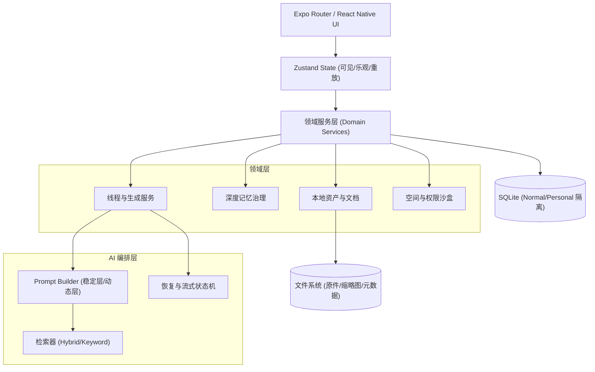

# Pixory AI 核心引擎与底层架构技术解析


本文档深度剖析 Pixory 在Local-First架构下，支撑复杂 AI 陪伴聊天与本地数据管理的核心算法、数据结构与系统设计。我们公开了在移动设备上实现万字级长文流式渲染、微秒级本地检索引擎、动态上下文装填以及严格隐私隔离的工程落地细节。

---

## 1. 客户端分层与领域架构总览

Pixory 摒弃了由 UI 直接拼装 Prompt 的薄客户端模式，在 React Native 与底层引擎间构建了严密的领域服务层（Domain Layer）。



---

## 2. 动态 Prompt 编译与上下文预算调度算法

为解决“模型窗口有限”与“陪伴记忆无限”的根本矛盾，Pixory 实现了严格的分级编译与动态截断算法，并完美适配大模型（如 DeepSeek V4）的 Prefix Caching。

### 2.1 稳定层与动态层严格分离

系统将 Prompt 彻底解耦为 8 个物理段，以确定的顺序拼接：
1. **稳定层（Stable Layer）**：`stable_app_policy` (应用边界) -> `stable_role` (角色与性格参数) -> `stable_material_rules` (引用协议) -> `stable_tool_definitions` -> `memory_snapshot` (人工锁定的核心记忆)。
2. **动态层（Dynamic Layer）**：`history_window` (历史回溯) -> `companion_runtime` (好感/关系投影) -> `temporal_open_loops` (未决事件) -> `summary_bridge` (摘要桥接) -> `dynamic_memory` (动态注入记忆) -> `retrieval_context` (RAG 片段) -> `current_user_message` (当轮问题)。

**缓存防污染（Cache Purity）**：所有的 `UUID`、`Timestamp`（如当前精确到秒的请求时间）严禁进入稳定层。稳定层的内容生成唯一的 `StablePrefixHash`，利用 Provider 原生的连续前缀缓存，可将长角色的 Token 命中率稳定在 90% 以上。

### 2.2 上下文预算与分桶（Context Budgeting Algorithm）

系统默认按中文字符 `0.8 Token`，非中文 `0.25 Token` 的轻量级分配器估算当前 Prompt 成本，随后实施安全预算公式。

```text
// 1. 确定实际可用预算上限（预留 30% 用于防御模型底层波动）
safeBudget = floor(modelWindow * 0.70)

// 2. 扣除必要的生成输出保留空间
generationReserve = max(512, safeBudget * 0.12)
usableBudget = safeBudget - generationReserve
```

然后将 `usableBudget` 分配至 `C0` 到 `C6` 共 7 个桶中：
*   **C0 (10%)**：应用策略与角色核心
*   **C1 (10%)**：材料规则与工具定义
*   **C2 (8%)**：记忆快照
*   **C3 (8%)**：关系与运行时
*   **C4 (剩余)**：历史记录与摘要
*   **C5 (12%)**：检索材料
*   **C6 (10%)**：当轮问题与观察

### 2.3 裁剪降级顺序（Eviction Policy）

当输入超过 `usableBudget` 时，执行 O(1) 优先级的降级裁剪：
1. **裁剪动态区**：依序裁剪 检索片段(C5) -> 历史(C4) -> 动态记忆。
2. **裁剪受保护区**：记忆快照(C2)压缩为骨架级别。
3. **触底保护**：`current_user_message` 和 `summary_bridge` 无论如何**不允许截断**，确保当轮语义的绝对完整；被丢弃的片段将被替换为 `[已因模型上下文窗口裁剪]` 审计标记。

---

## 3. 混合记忆检索与事实治理模型 (Memory Governance)

Pixory 避免了简单的“文本 Embedding 堆叠”，构建了带生命周期的记忆状态机。

### 3.1 记忆数据模型与车道

所有被提取的记忆划分为三车道：
*   **Working**：演化中、待确认事实。
*   **Confirmed**：用户明确确定的长期事实。
*   **Archive**：历史快照。

数据实体包含严密的外键追踪：`canonicalClaimId` (规范化聚类ID), `sourceMessageId` (溯源ID), `confidence` (置信度), `safetyState` (安全态)。

### 3.2 极速混合检索管道 (Hybrid Retrieval Pipeline)

1.  **输入归一化**：当前对话实施 `NFKC` 转换与连续空白过滤。
2.  **词面预筛 (Lexical Fallback)**：本地进行 N-gram (2-3字) 切词，通过 SQLite FTS5 在本地过滤出候选集。
3.  **多维评分 (Multi-Dimensional Scoring)**：
    向量服务只有在 **250ms** 内返回才计入成绩，否则静默降级到纯词面检索。最终评分公式为：
    ```text
    Score = (0.30 * lexical_similarity) 
          + (0.20 * semantic_embedding) // 向量超时则置 0，并提升 lexical 权重
          + (0.15 * temporal_freshness) // 时间衰减，近期越优先
          + (0.15 * continuity_bonus)   // 同分支、同线程加权
          + (0.10 * user_importance)
          + (0.10 * ai_confidence)
          - stalePenalty - conflictPenalty - redundancyPenalty
    ```
4.  **注入决断**：阈值卡定在 `0.55`，最多注入 6 条；依据 `canonicalClaimId` 去重。

### 3.3 记忆防篡改与使用契约

对冲突事实建立安全墙。如果遇到 `safety_pending` 状态的新记忆与 `Confirmed` 的旧记忆冲突：
系统强制将提示词前缀修改为 `ask_before_action` 契约，迫使 AI 在生成回答前：“我记得之前是 A，现在你提到的是 B，请问以哪个为准？” 从而杜绝了模型自我幻觉导致的记忆静默覆写。

---

## 4. 陪伴内心运行时算法 (Companion Inner Life)

在传统的 Request-Response 模式外，实现了后台自发演化的情感系统。

### 4.1 离线思绪调度 (Offline Thoughts)

当一场完整的用户-助手对话结束后，系统启动一个持续 **10分钟** 的静默观测窗口。
*   **情感阈值触发**：本地规则引擎分析最新消息特征，匹配“脆弱、受伤、和解、道歉、赞美、冷淡”等情感。
*   **幂等生成**：生成任务通过 SQLite `Lease`（租约）加锁，并以单一事务完成 Job 状态、消息游标的转移。失败的任务会释放租约并不消耗当日额度（每天最多 3 条），思绪作为一种“一次性低权限上下文”被秘密送入下一次主聊天。

### 4.2 角色梦境概率引擎 (Dream Engine)

梦境完全不受前台交互驱动，依靠 Android 系统层的 `AlarmManager` 和 `Headless JS` 执行。
*   **本地候选探测**：根据语境宽筛选（睡前场景/晚安）。
*   **冻结溯源 (Context Freezing)**：在触发瞬间，立刻固化当时的 `branch_route`（分支树节点）、`source_message_hash`，确保重试时的输入具备绝对一致性，不会因事后修改历史而雪崩。
*   **概率分布决定**：经过确定性的 RNG 抛骰子算法，按阶段划分为 `55% -> 40% -> 30% -> 10% -> 10%` 梯级概率。生成后的梦境卡片使用独立阅读器加载，且必须经过用户的 `[同意接入]` 才允许污染主线程的上下文。

---

## 5. 容灾生成状态机与高性能流式渲染

移动端网络经常断流，App 切后台会立即被系统挂起（Killed），Pixory 设计了自愈合的生成链路。

### 5.1 本地容灾状态机 (Crash Recovery State Machine)

每次对话都会生成一个不可变的 `generationId`，落入本地持久化数据库：
```text
State Transition:
created 
  --> local_persisted (此时 App 崩溃，用户消息不丢失)
  --> request_started (此时断网，进入 recoverable_interrupted)
  --> first_byte 
  --> streaming 
  --> terminal (completed / failed / stopped)
  --> final_persisted (更新 Token 指标与本地索引)
```
如果 App 在 `streaming` 阶段被系统强杀，重启后将直接捕获该未完成的 Job。有部分落盘正文的任务将带上上下文发起“续写请求”（做重叠去重）；无正文的任务将从零安全重试，保障数据完整性。

### 5.2 大文本流式渲染引擎 (Double-Lane Streaming UI)

React Native 在面对高频的长文本流式更新时极易出现严重卡顿。我们抛弃了传统的“全文重绘”。
*   **双泳道分离 (Lane Isolation)**：将模型的“思维过程（Reasoning）”与“正文（Content）”放入相互独立的透明表面和气泡视图。同一行文本的追加不改变气泡外部宽度，只在遇到 `\n` 时才增加高度。
*   **尾部占位与高度缓存 (Measured Tail Occupancy)**：维护一个底部的实体高度隔离块 `AiStreamingTailSpacer`。上滑时停止测算，只有在原生游标 `offset` 位于底部 32px 安全区内、滚动稳定且尾块高度债归零时，才在下一帧更新流式视口。
*   **解耦映射契约**：将 `generationId` / `startOffset` 与组件的 `blockIndex` 完全解耦，使用恒等契约处理终态更新，避免了因为 React Key 跳动导致整个长消息组件强制 Unmount/Mount。

### 5.3 稳定 keyset 游标与 O(n) 合并

超过 6000 条的大型聊天页面不再使用传统的 `OFFSET/LIMIT` 分页（这在 SQLite 中极慢且容易数据漂移）。
系统使用复合游标 `(lastMessageAt, createdAt, id)` 进行查询。回灌本地消息库时，通过 `(createdAt, id)` 对输入流和既有流进行单次顺序合并（O(n)），避免对庞大的历史数组进行反复的 `sort()` 计算。

---

## 6. 本地 RAG、并发防线与 Personal 沙盒系统

### 6.1 引用协议与后置防伪 (Fact-Checking)

RAG（检索增强生成）面临最严峻的问题是模型的凭空捏造（幻觉引用）。
*   在传递给模型时，文本块被切片并挂载内部钩子，格式为 `[S1]`, `[S2]`。
*   模型输出结束落盘时，引擎反向校验：提取回答中的 `[S1]` 引用，去数据库复核该切片的 `documentVersion` 以及 `SHA-256` 摘要签名，验证词面覆盖度。如果模型伪造了引用，或者对应的本地原文件已被用户删除，UI 层将在渲染时主动剥离该失效引用。

### 6.2 I/O 账本与并发控制门禁 (Bounded Concurrency)

同时混合导入上千张图文会瞬间压垮手机 I/O 与内存：
*   建立统筹的 `MediaImportCommitBudget`，共享一次 1000 实体 / 256MB 单文件 / 32GB 总盘余量的 Gate 校验。
*   在执行重型的元数据分析、缩略图计算之前，进行预先文件体积探测。图片解析和视频解码器使用硬上限池（最多 4 Worker 并行，视频加载严格保持 Current + 前 3 + 后 1 个预加载窗口），保证低端机也能流畅运行。

### 6.3 严格的数据存储沙盒 (Space Isolation)

不同于某些应用仅在 UI 上做视觉隐藏，Pixory 对隐私内容实施底层物理切割：
*   **独立数据库实例**：普通空间与隐私空间（Personal）分别对应物理隔离的 `pixory.sqlite` 和 `pixory_personal.sqlite`。
*   **安全锁闭降维打击**：当触发隐私空间锁定时，后台服务不只是隐藏 UI，而是按顺序：
    1.  使全局的 Task Token 无效化（中断所有异步解析与生成）。
    2.  等待正在进行的 SQLite 事务到达 Checkpoint（防写坏）。
    3.  彻底清理所有内存媒体 LRU 缓存。
    4.  物理关闭 `personal.sqlite` 数据库句柄。
*   **凭据零暴露**：云端模型的 API Key 与个人恢复密码永远只保存在设备底层的非对称 `SecureStore` 容器内，日志文件和备份导出 Manifest (JSON) 中严禁包含以上字段的明文，哪怕被 root 提权，备份文件也无法泄露关键凭据。

---

## 7. Provider 级缓存策略路由器 (Multi-Provider Cache Policy)

Pixory 支持 DeepSeek、OpenAI、Anthropic、Gemini 四大协议，每家的缓存机制截然不同。系统在 `buildProviderCachePolicy` 中实现了一个策略路由器，根据 `provider.protocol` + `modelId` 自动选择最优的缓存适配方案。

### 7.1 DeepSeek Native 策略 (`deepseek_native`)

**触发条件**：`protocol === 'openai_compatible'` 且 modelId 命中官方 DeepSeek V4+ 端点白名单。

DeepSeek 官方原生前缀缓存**无需客户端发送任何 cache key**。系统只需开启 `openAiIncludeUsage: true`，服务端会在响应的 `usage` 字段中自动返回 `prompt_cache_hit_tokens` / `prompt_cache_miss_tokens`。Pixory 解析这两个字段并计算 `cachedTokenRatio`，写入本轮的生成指标。注意：对非官方中转网关不应用此策略，因为中转方不一定透传缓存 usage 数据。

### 7.2 OpenAI Prompt Cache Key 策略 (`openai_prompt_cache_key`)

**触发条件**：`protocol === 'openai_compatible'` + `providerType === 'openai'` + 稳定前缀 Token 数 ≥ 1024。

系统组装一个确定性的复合缓存键：

```text
openAiPromptCacheKey =
  "pixory"
  + ":pv{promptVersion}"      // Prompt 协议版本（当前 v1）
  + ":{providerId}"
  + ":{modelId}"
  + ":{chatMode}"             // companion / roleplay / knowledge / personal
  + ":{stablePrefixHash}"     // SHA-256 of 归一化稳定块
  + ":{memoryEpoch}"          // 记忆投影版本轮次
  + ":rv{retrievalVersion}"   // RAG 版本（当前 v1）
  + ":{scopeKey}"             // thread/ip/knowledgeBase scope
  + ":{branchRouteHash}"      // 当前采用分支路线哈希
  + ":{generationParamsHash}" // temperature/top_p 等参数哈希
```

该 Key 在内容不变时保持稳定，任何会影响 AI 行为的参数变化都会导致 Key 失效——保证缓存命中不会对用户产生行为偏差。

### 7.3 Anthropic 双断点缓存策略 (`anthropic_ephemeral`)

Anthropic 的 `cache_control: {"type": "ephemeral"}` 支持在 system prompt 中设置最多 4 个断点。Pixory 采用**双断点**设计：

*   **Core Breakpoint**：覆盖 `stable_app_policy + stable_role + stable_material_rules + stable_tool_definitions`（角色核心层），不含 `memory_snapshot`。
*   **Prefix Breakpoint**：覆盖全部稳定块，含 `memory_snapshot`。

启用门槛按模型差异化：
```text
Haiku 系列（轻量模型）: core_threshold = 2048 tokens, prefix_threshold = 2048 tokens
其他 Claude 模型:       core_threshold = 1024 tokens, prefix_threshold = 1024 tokens
```

Prefix 断点额外检测 TTL 是否到期（上次请求距今 > 5 分钟），避免发送一个服务端已过期的断点标记浪费 API 开销。

### 7.4 Gemini 隐式缓存策略 (`gemini_implicit`)

Gemini 不需要客户端声明缓存位置，服务端自动对连续前缀做隐式缓存。Pixory 的策略是：当稳定前缀估算 Token 数 ≥ 1024 时，标记 `requested: true`，这会在生成指标中记录"已尝试触发 Gemini 隐式缓存"。

### 7.5 Provider TTL 与缓存过期检测

```text
Anthropic:        TTL = 5 分钟
Gemini:           TTL = 5 分钟
OpenAI-compatible:TTL = 10 分钟
```

`ttlLikelyExpired()` 函数通过对比 `previousRequestAt` 与 `requestedAt` 的时间差与 TTL，判断服务端缓存是否已大概率失效。该结果用于 Anthropic 策略中的 Prefix 断点启用决策。

---

## 8. Prompt 稳定块纯度检验 (Stable Block Purity Lint)

前缀缓存的最大敌人，是开发者无意中把易变内容混入稳定块。系统实现了 `lintStablePromptBlocks()` 函数，在每次 `buildPromptCacheMetadata` 时对所有 `stable: true` 的块执行正则扫描：

```text
ISO 日期扫描: /\b\d{4}-\d{2}-\d{2}(?:[T\s]\d{2}:\d{2}...)?/
UUID 扫描:   /\b[0-9a-f]{8}-[0-9a-f]{4}-[1-5][0-9a-f]{3}...\b/i
RequestID 扫描: /\b(?:request|req|trace|span|session|turn)[_-]?id\b/i
```

一旦命中，就在 `AiPromptCacheMetadata.purityWarnings` 中追加 `"{blockName}:contains_date_like_text"` 这样的带名字段警告，供诊断系统和开发者工具捕获。**警告不中断生成**，但在 dev 环境会触发可见提示，确保工程师在开发期就发现污染，而不是在生产环境造成频繁缓存失效。

哈希本身也经过 NFKC 归一化、行尾空白裁剪和换行符统一处理后，才计算 SHA-256——这保证了跨平台（Windows CR+LF vs Unix LF）和不同编辑器风格不会导致相同内容产生不同哈希。

---

## 9. 记忆系统完整数据模型 (Full Memory Schema)

### 9.1 Claim 完整字段体系

`MemoryClaimRecord` 是记忆系统的核心实体，包含约 35 个字段，远超一般 AI 记忆系统的设计深度：

| 字段组 | 字段 | 说明 |
|---|---|---|
| **身份** | `id`, `canonicalClaimId`, `relatedClaimGroupId` | 唯一ID、规范化聚类ID（同一事实多来源聚合）、冲突组ID |
| **分类** | `kind`, `actor`, `polarity`, `stability` | 记忆类型、主体、极性、时效性 |
| **语言模式** | `speechMode` | 8 种语用模式，防止误提取 |
| **置信度** | `confidenceRaw`, `confidenceCalibrated`, `confidenceBand` | 原始置信 / 校准置信 / 高中低三段 |
| **时间** | `validFrom`, `validTo`, `validPrecision`, `rawTimePhrase` | 四级时间精度（exact/day/month/relative） |
| **治理** | `status`, `safetyState`, `manualLocked` | 8 状态生命周期 + 安全态 + 用户锁定 |
| **溯源** | `sourceMessageId`, `sourceKind`, `extractorVersion` | 源消息、来源类型、提取器版本 |
| **作用域** | `scopeType`, `scopeId` | 6 级作用域（global/role/ip/knowledge_base/thread/branch） |
| **审计** | `projectionVersion`, `ontologyVersion`, `version` | 多版本防脏读 |

### 9.2 语言行为分类（SpeechMode）

记忆提取前，必须先对消息的**语用模式**分类，防止把假设、玩笑、角色扮演内容误存为事实：

| SpeechMode | 含义 | 提取策略 |
|---|---|---|
| `asserted` | 用户直接陈述的事实 | 正常提取，高置信 |
| `corrected` | 用户纠正旧事实 | 提取并触发 supersede 旧记忆 |
| `negated` | 否定表达 | 提取 `polarity=negative` 记忆 |
| `hypothetical` | 假设/如果场景 | **不提取**为事实 |
| `joke` | 玩笑语境 | **不提取** |
| `quoted` | 引用他人话语 | **不提取**为用户事实 |
| `roleplay` | 角色扮演场景 | **不提取**为现实事实 |
| `uncertain` | 模糊/不确定表达 | 提取但 `confidenceBand=low` |

### 9.3 关系投影状态（Relational State）

`MemoryRelationalStateRecord` 对每对 `(subject, scope)` 维护 4 个维度的投影数值，且通过**衰减半衰期**建模关系随时间自然演变：

```text
metric 维度:
  affinity   — 好感度（被积极/消极事件驱动）
  trust      — 信任度（被可靠性/欺骗事件驱动）
  tension    — 紧张度（被冲突/道歉事件驱动）
  familiarity — 熟悉度（被互动频率累积）

decayHalfLifeDays — 该维度值在无事件时的自然半衰期（天）
signalWeight      — 本次事件的权重，用于加权累积
```

这些数值**永远不直接暴露给用户**，仅通过角色提示中的"关系状态描述语"间接影响 AI 生成，避免用户产生被数值化的不适感。

### 9.4 确认治理边界（Governance Invariant）

`resolveConfirmationGovernance()` 强制执行一条**不可绕过的规则**：

```typescript
if (claim.safetyState === 'safety_pending' && actorType !== 'user') {
  throw new Error('memory_safety_confirmation_requires_user');
}
```

系统自动维护（`actorType: 'model'` 或 `'system'`）**永远无法将 `safety_pending` 的记忆升级为 `safety_confirmed`**，只有用户本人的显式确认操作才能完成这一转换。这是防止 AI 自我扩权的关键护栏。

---

## 10. 生成指标的内容无关可观测性 (Content-Free Observability)

Pixory 的诊断系统在设计上就要求"**可观测但不泄露**"——记录所有能定位问题的结构化指标，但严禁记录任何对话正文内容。

### 10.1 时间戳流水线（25+ 个关键节点）

每次生成对应一条 `AiGenerationMetrics`，记录从用户按下发送到 UI 稳定的完整时间轴：

```text
sendPressedAt
  → userMessagePersistStart/End      // 用户消息落盘耗时
  → assistantPlaceholderPersistStart/End  // 占位消息创建耗时
  → branchResolveStart/End           // 分支路线解析耗时
  → memoryResolveStart/End           // 记忆检索耗时
  → retrievalStart/End               // RAG 检索耗时
  → historyLoadStart/End             // 历史消息加载耗时
  → promptBuildStart/End             // Prompt 编译耗时
  → providerRequestSentAt            // 请求发出时间
  → firstProviderDeltaAt             // 首个 Token 到达（TTFD）
  → firstUiPatchAt                   // 首个 UI 更新（可见延迟）
  → lastProviderDeltaAt              // 最后一个 Token
  → finalPersistStart/End            // 最终落盘耗时
  → generationSettledAt              // 整个生成链路完成
```

由这些时间戳派生的关键业务指标：
*   `sendToFirstDeltaMs`：发送到首 Token 的端到端延迟（TTFD）
*   `promptPipelineMs`：Prompt 编译管线总耗时
*   `cachedTokenRatio`：Provider 返回的缓存命中比例（`cachedInputTokens / totalPromptTokens`）
*   `devicePressureThrottled`：本轮是否因设备内存压力触发了渲染节流

### 10.2 禁止字段白名单（Forbidden Key Enforcement）

`assertContentFreeGenerationMetrics()` 在指标落盘前通过正则扫描整个序列化 JSON，一旦发现以下字段名就立刻抛出异常，拒绝入库：

```text
禁止字段: prompt, promptText, system, systemPrompt, user, userMessage,
          assistant, assistantReply, memory, memoryText, retrieved,
          retrievedText, materialText, snippetText, content
```

这一机制从根本上杜绝了"偶然调试时把 Prompt 正文写入诊断表"的工程失误。即使在最激进的 debug 模式下，Pixory 的诊断数据库也无法成为对话内容的镜像。

---

## 11. SillyTavern 角色卡兼容层算法

SillyTavern 是最主流的本地 AI 角色扮演平台，其角色卡格式已成为事实标准。Pixory 实现了完整的 V1/V2/V3 兼容解析层。

### 11.1 sourceJson 三版本解析

```text
V1 (legacy): 顶层 JSON 对象，字段扁平
V2 (chara_card_v2): { spec: 'chara_card_v2', data: { ... } }
V3 (chara_card_v3): { spec: 'chara_card_v3', data: { ... } }
```

`resolveRolePromptContext()` 优先读取 `sourceJson`（SillyTavern 原始卡片），并通过 `readSillyTavernData()` 识别版本后提取 `data` 子对象。当 `sourceJson` 存在时，从卡片中读取 `description / personality / scenario / system_prompt / mes_example / post_history_instructions`，忽略 Pixory 界面的编辑字段——保证导入卡片的角色行为与原平台一致。

### 11.2 防双注入去重（Strip Structured Sections）

SillyTavern 卡片的某些字段（角色描述、性格等）会被 Pixory 结构化地重新注入为 `## 角色描述` 等标准段。但有些用户在卡片的系统提示 `system_prompt` 字段里会**再次手动写入这些段落**，造成双重注入。

`stripStructuredSillyTavernSections()` 在有 `sourceJson` 时，对 `systemPrompt` 字段做预处理：识别并剔除以下预定义标题的 `##` 段落（同时保留其他自定义内容）：

```text
需要剔除的段落标题集合:
  角色描述 / 性格 / 场景 / 系统提示 / 历史后指令 / 对话示例
```

### 11.3 宏展开（Macro Substitution）

所有角色文本在注入前经过宏展开，将 SillyTavern 通用占位符替换为实际值：

```text
{{char}}  →  角色卡的 name 字段（缺省为"当前角色"）
{{user}}  →  用户显示名（缺省为"用户"）
```

匹配规则对空格宽容：`/\{\{\s*char\s*\}\}/gi`，支持 `{{ char }}`、`{{CHAR}}` 等变体。

### 11.4 角色权重框架（Role Instruction Weight）

当用户希望角色设定拥有更强的覆盖权时，可以设置 `roleInstructionWeight: 'high'`，系统在注入时切换为更强调优先级的框架前缀：

```text
default weight → "当前会话角色指令如下。它是本次请求的角色设定，必须在回答中体现。"
high weight    → "【最高优先级：当前会话角色指令】下面内容定义本会话的身份、语气、边界和输出方式。"
```

---

## 12. 分支树作用域可见性算法 (Branch Scope Visibility)

分支（Branch）是 Pixory 对话中最重要的结构之一——用户可以从任意历史消息分叉出新的对话路线，相当于对话的"版本树"。但这引入了一个难题：记忆、关系投影和陪伴事件必须只对当前路线的"祖先 lineage"可见，不能因为存在其他分支而被污染。

### 12.1 作用域决策函数（scopeAllowed）

```typescript
function scopeAllowed(
  claim: MemoryClaimRecord,
  thread: AiThreadRecord,
  branchScopes: AiBranchScope[]  // 当前采用路线的所有祖先分支节点
): boolean
```

按以下优先级逐条判断：

| claim.scopeType | 可见条件 |
|---|---|
| `thread` | `claim.scopeId === thread.id` |
| `role` | `claim.scopeId === thread.roleCardId` |
| `ip` | `thread.boundIpId != null && claim.scopeId === String(thread.boundIpId)` |
| `knowledge_base` | `thread.boundKnowledgeBaseId && claim.scopeId === thread.boundKnowledgeBaseId` |
| `branch` | `branchScopes.some(s => claim.scopeId === \`${s.branchRootMessageId}:${s.branchVersionIndex}\`)` |
| `global` | 始终可见 |

分支记忆的 `scopeId` 格式为 `"{branchRootMessageId}:{branchVersionIndex}"`，只有**当前采用路线**的所有祖先节点集合（`branchScopes` 数组）中存在匹配时才可见。这意味着从同一消息分出的兄弟分支，其记忆在彼此之间是完全不可见的。

### 12.2 Intent 意图检测与指代消歧

当用户说"忘掉这件事"或"上条纠正一下"时，系统通过 `resolveMemoryIntentTargetClaimIds()` 进行**指代消歧**：

*   **近指词检测**（这个/这件事/刚才/上条/那件事）：直接取当前线程中 `scopeType === 'thread'` 的最近一条记忆，不做词面搜索。
*   **词面搜索路径**：剥离操作动词（忘掉/忘记/纠正/改成等），对剩余内容做 N-gram 切词后执行词面评分，按分支可见性过滤后取前 3 条最高分匹配。

### 12.3 快路径分类（Fast Path Classifier）

并非所有消息都需要完整的检索管道。`shouldRetrieveMemory()` 实现了一个零成本的预检查：

```text
直接跳过检索的场景:
  1. 消息去空格后长度 < 2 字符
  2. 纯社交应答：/^(哈哈|嗯嗯|哦哦|好的|好呀|谢谢|晚安|早安)[。！!？?]*$/
  3. N-gram 切词后词项数为 0（无实质性内容词）
```

对于这类消息，检索管道**完全跳过**，不执行任何 SQL 查询，首 Token 延迟可下降 20-50ms（具体取决于设备 SQLite 性能）。

---

## 13. 设计约束汇总与不变量清单

以下不变量在系统各处通过代码层面强制保障，属于**不允许妥协的工程红线**：

| 不变量 | 保障位置 | 违反后果 |
|---|---|---|
| 生成指标不含对话正文 | `assertContentFreeGenerationMetrics` 抛异常 | 落盘前即中断 |
| 非用户 actor 不得确认 safety_pending 记忆 | `resolveConfirmationGovernance` 抛异常 | 操作被完全拒绝 |
| 稳定块不含 ISO 日期/UUID | `lintStablePromptBlocks` 写警告 | 诊断记录 + dev 提示 |
| Personal 数据不进入普通空间查询 | 数据库空间注册表 + 服务接口显式 space 参数 | 双重隔离 |
| 分支记忆只对当前 lineage 可见 | `scopeAllowed` 严格过滤 | 获取空结果 |
| 当轮消息和摘要桥不可截断 | `promptBlockPriority('required')` 在裁剪循环中跳过 | 裁剪轮次不处理 |
| generationId 已过期的 patch 不更新可见消息 | 流式运行时 generationId 比对 | 丢弃旧代 patch |
| 原始导入文件不可被覆盖/压缩 | 导入服务只写 staging 区域 | 事务提交前校验路径 |
