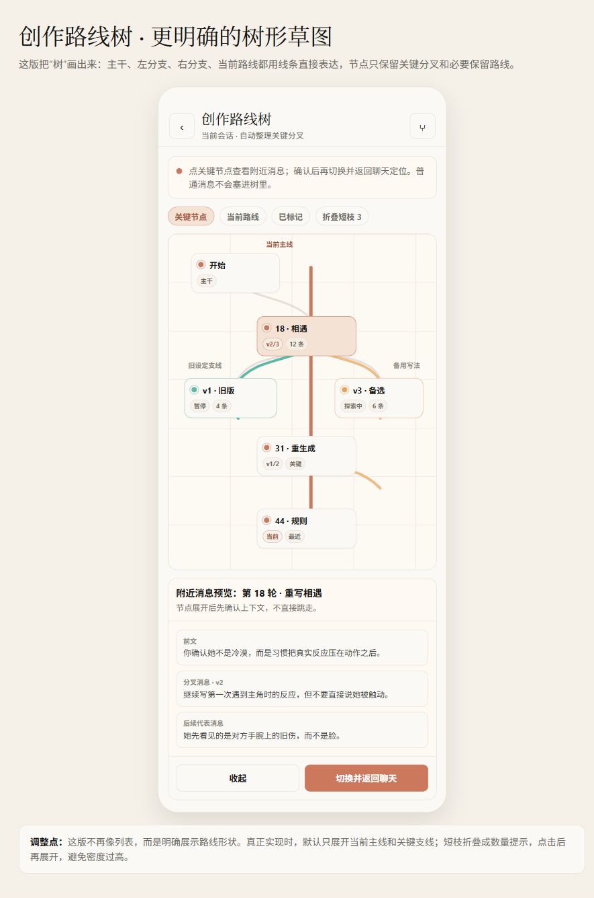

# AI Branch Tree Navigation Design

> **For agentic workers:** REQUIRED NEXT STEP: Use `superpowers:writing-plans` to create the implementation plan after this spec is approved.

**Date:** 2026-05-29

**Goal:** Add a calm, mobile-first branch tree navigator to AI chat so users can quickly find, preview, and switch to routes created by editing earlier messages or regenerating replies in long conversations.

**Recommended implementation scope:** Hybrid approach. Derive the branch tree automatically from existing message versions and branch scope fields, then persist only lightweight route metadata such as route name and status. Do not duplicate the full tree into SQLite.

**Reference mockup:**



---

## Current Problem

Pixory AI already supports message versions and branch scoping. When a user edits an earlier sent message or regenerates an assistant reply, a new branch line can be created and later messages can be scoped to that branch.

The current UI exposes this mostly through per-message version controls such as `1/2` or `2/3` inside chat bubbles. This works for short conversations, but it becomes hard to use when the record is long:

- Users must scroll through many messages to find the original modified node.
- Hidden or older routes are difficult to rediscover.
- Branch switching is visually local to one message bubble, not understandable as a route.
- Users cannot quickly inspect nearby context before switching.

The new feature should make branches feel like creative routes, not technical version hashes.

## Non-Goals

This pass does not implement the full Creative Continuity Kernel Memory & Branch layer.

Out of scope:

- Automatic canon promotion.
- Automatic memory promotion from adopted routes.
- Full route comparison.
- Complex Git-style graph controls.
- Cloud sync, server state, or provider-specific branch storage.
- Automatic deletion of branches, messages, memories, or user-visible route history.
- Turning the tree into a second full chat transcript.

## Product Requirements

### Entry Point

Add a branch tree entry button to the AI chat header.

Placement:

- In `AiChatScreen`, place the branch tree icon on the right side of the header.
- It should sit to the left of the existing session settings entry.
- Use an Ionicons-style Git branch icon, for example `git-branch-outline`, if available.
- Match existing AI header icon button size, radius, border, press opacity, and light theme.

Availability:

- If the current chat has no thread id yet, hide or disable the entry.
- If a thread exists but has no branch nodes, opening the page should show a designed empty state.

### Branch Tree Page

Create a dedicated page, tentatively named `AiBranchTreeScreen`.

The page should use the existing AI light design system:

- `AiLightScaffold`
- `aiLightColors`
- shared design tokens from `src/design/tokens/`
- cream canvas, warm ink text, coral primary emphasis, hairline borders
- no heavy gradients, glassmorphism, neon, decorative clutter, or oversized cards

Header copy:

- Title: `创作路线树`
- Subtitle: `当前会话 · 自动整理关键分叉`

Short guidance:

```text
点关键节点查看附近消息；确认后再切换并返回聊天定位。普通消息不会塞进树里。
```

Do not add long explanatory copy inside the graph itself.

### Graph Shape

The branch tree must visually read as a tree, not as a list.

Required visual structure:

- A vertical main route line.
- Curved branch lines splitting left or right from a root node.
- Nodes placed on different route lanes when they represent different branches.
- Current route highlighted with coral.
- Non-current branches displayed with quieter accent colors and lower visual weight.
- Short or low-value branches collapsed into a small count indicator.

The graph may be implemented with React Native `View` lines, `Svg` if an existing dependency is already available, or a deterministic canvas-like layout. Do not add a heavy graph library for this first pass.

If no suitable graph rendering dependency exists, prefer simple native layout:

- absolute-positioned lane lines
- compact node chips
- curved approximations only where practical
- deterministic vertical spacing

The first implementation should favor clarity and touch reliability over decorative graph precision.

## Information Density

The tree is a navigation surface, not a transcript.

### Default Node Content

Each visible graph node should show only core information:

- Round number or sequence label, such as `18 · 相遇`
- Version state, such as `v2/3`
- Route status, such as `当前`, `暂停`, `探索中`, `已采用`, `放弃`
- Follow-up count, such as `12 条`

Do not show explanatory sentence content inside graph node cards by default.

Avoid node text like:

```text
当前采用：保留旧伤细节，降低戏剧化台词。
```

That level of detail belongs in the nearby message preview after the user taps the node.

### Visible Node Policy

Default tree view should show only:

- Branch roots created by editing an earlier user message.
- Branch roots created by assistant regeneration when multiple assistant versions exist.
- Nodes on the current selected route path.
- Nodes with enough follow-up messages to be worth rediscovering.
- Recently created branch nodes, even if short.
- User-marked route nodes.

Default tree view should hide or collapse:

- Ordinary non-branch messages.
- Failed or empty branches with no useful content.
- Very short abandoned branches unless recent or user-marked.
- Deep low-value detail branches that would clutter the view.

Collapsed branches should appear as small count chips, for example:

```text
折叠短枝 3
```

### Screen Occupancy

The graph should occupy the primary screen area after the header and guidance.

Target mobile behavior:

- One screen should show roughly 4-6 key nodes.
- A node should be compact enough to avoid line overlap and card collisions.
- Graph panning or scrolling should be vertical first.
- Horizontal complexity should be bounded to 2-3 visible lanes on a phone.
- When there are more lanes, collapse side branches or open a focused route view.

## Nearby Message Preview

Tapping a node does not immediately jump back to chat.

Instead, it opens an inline preview panel under or near the selected node.

Preview content:

- One previous context message.
- The selected branch root message version.
- Two representative follow-up messages from that route.
- Route status and follow-up count.

Preview controls:

- Primary: `切换并返回聊天`
- Secondary: `收起`

If the selected node is already on the current route:

- Primary label should become `返回聊天定位此处`.

Preview text may show longer content than the graph node, but still should be bounded:

- Clamp each message to 2-3 lines.
- Provide a later `查看更多附近消息` action only if needed.
- Do not turn the preview into a full transcript.

## Route Metadata

Use a hybrid model.

### Derived Tree

The actual branch topology should be derived from existing data:

- `ai_messages.branchRootMessageId`
- `ai_messages.branchVersionIndex`
- `ai_message_versions.originalMessageId`
- `ai_message_versions.versionIndex`
- message timestamps
- message roles and statuses

This ensures the tree updates automatically whenever the user edits or regenerates messages.

### Persisted Metadata

Persist only optional user-facing route metadata.

Candidate table:

```sql
CREATE TABLE IF NOT EXISTS ai_branch_route_metadata (
  id TEXT PRIMARY KEY NOT NULL,
  threadId TEXT NOT NULL,
  branchRootMessageId TEXT NOT NULL,
  branchVersionIndex INTEGER NOT NULL,
  name TEXT,
  status TEXT NOT NULL DEFAULT 'exploring'
    CHECK (status IN ('exploring', 'adopted', 'paused', 'abandoned')),
  note TEXT NOT NULL DEFAULT '',
  createdAt TEXT NOT NULL,
  updatedAt TEXT NOT NULL,
  FOREIGN KEY (threadId) REFERENCES ai_threads(id) ON DELETE CASCADE,
  FOREIGN KEY (branchRootMessageId) REFERENCES ai_messages(id) ON DELETE CASCADE,
  UNIQUE(threadId, branchRootMessageId, branchVersionIndex)
);

CREATE INDEX IF NOT EXISTS idx_ai_branch_route_metadata_thread
  ON ai_branch_route_metadata(threadId, updatedAt);
```

Metadata rules:

- Metadata is optional.
- Missing metadata means the route is unnamed and implicitly `exploring`.
- Marking a route `adopted` does not automatically promote memory or canon.
- Marking a route `abandoned` does not delete messages.
- Route status is for navigation and user understanding only in this pass.

## Branch Tree Data Model

Service-level output should be UI-oriented and bounded.

Candidate TypeScript model:

```ts
export type AiBranchRouteStatus = 'exploring' | 'adopted' | 'paused' | 'abandoned';

export interface AiBranchTreeNode {
  id: string;
  threadId: string;
  branchRootMessageId: string;
  branchVersionIndex: number;
  parentBranchRootMessageId: string | null;
  parentBranchVersionIndex: number | null;
  rootRole: 'user' | 'assistant' | 'system';
  title: string;
  preview: string;
  versionLabel: string;
  followUpMessageCount: number;
  status: AiBranchRouteStatus;
  name: string | null;
  isCurrentRoute: boolean;
  isRecent: boolean;
  isCollapsedRepresentative: boolean;
  createdAt: string;
  updatedAt: string;
}

export interface AiBranchTreePreview {
  node: AiBranchTreeNode;
  previousMessages: AiBranchPreviewMessage[];
  selectedMessage: AiBranchPreviewMessage;
  followUpMessages: AiBranchPreviewMessage[];
}
```

The screen should not query arbitrary full history after every render. Build a repository/service method that returns already bounded tree nodes.

## Auto-Update Rules

The tree should refresh when:

- The branch tree screen opens.
- The user returns to the tree after editing or regenerating in chat.
- Chat messages are reloaded.
- Route metadata is saved.

The tree should not require a manual rebuild job.

For long conversations, the service should:

- Query only branch candidates and required context rows.
- Avoid loading all message bodies when a bounded preview is enough.
- Use chunked `IN` queries if many ids are involved, following existing long-chat repository safety patterns.
- Sort deterministically by branch root message order, version index, and timestamp.

## Navigation Flow

User flow:

1. User opens a long AI chat.
2. User taps the branch tree icon in the chat header.
3. `AiBranchTreeScreen` opens for the current `threadId`.
4. The page shows current route path and key branch nodes.
5. User taps a node.
6. The page expands nearby message preview.
7. User taps `切换并返回聊天`.
8. The app returns to `AiChatScreen`.
9. Chat applies the target branch selection and scrolls to the branch root message.

### Chat State Integration

`AiChatScreen` already has `selectedVersionByMessageId`.

The branch tree should return enough selection data to update this map:

```ts
Record<string, number>
```

For nested branches, use resolved lineage:

- Include the selected node scope.
- Include parent branch scopes.
- Apply each root message id to the correct version index.

Then scroll to:

- `branchRootMessageId` if loaded.
- If not loaded, load enough earlier messages or use repository support to page around the target.

If exact scroll positioning fails:

- Fall back to loading the target route and showing a temporary in-chat notice.
- Do not silently switch route without some visual confirmation.

## Empty State

If the thread has no branch nodes:

Title:

```text
还没有分支路线
```

Body:

```text
修改旧消息或重新生成回复后，这里会自动出现路线节点。
```

Primary action:

```text
返回聊天
```

The empty state should use the existing AI light empty-state style. Keep it compact and real; no fake graph illustration is required.

## Error Handling

Cases to handle:

- Branch root message no longer exists.
- Version row is missing.
- Target branch has only failed or stopped messages.
- Selected node exists but target message is not in the loaded page.
- Route metadata exists for a branch that no longer has visible messages.

Behavior:

- Do not crash the tree.
- Mark invalid metadata-backed routes as unavailable or omit them.
- Show a quiet error banner if switching fails.
- Never delete route metadata or messages automatically in this feature.

## Design Rules

All AI page content, including dialogs, sheets, banners, and empty states, must follow `design.md` and the existing AI light style.

Hard requirements:

- Use cream canvas and light card surfaces.
- Use coral only for primary actions and current route emphasis.
- Use hairline borders and low visual weight.
- Use shared `spacing`, `rhythm`, `metrics`, `radius`, `colors`, and `typography` tokens.
- Avoid large explanatory cards.
- Avoid dense paragraphs inside graph nodes.
- Avoid decorative gradients, glass, neon, or cyber styling.
- Keep touch targets practical on Android.

For dialogs or bottom sheets:

- Use existing `AppDialog` or existing AI light components where possible.
- Keep copy short.
- Avoid full-screen confirmation unless the action is destructive.

## Suggested Files

Likely new files:

- `src/screens/AiBranchTreeScreen.tsx`
- `src/ai/aiBranchTreeService.ts`

Likely touched files:

- `App.tsx`
- `src/screens/AiChatScreen.tsx`
- `src/database/schema.ts`
- `src/database/db.ts`
- `src/database/repositories/aiThreadRepository.ts`
- `tests/ai-chat-fixes-policy.test.cjs` or a new dedicated branch tree policy test

Optional if metadata is included:

- Add repository methods for `ai_branch_route_metadata`.

## Testing Strategy

Add behavior-focused tests where possible.

Required coverage:

- Branch tree screen route exists and is reachable from `AiChatScreen`.
- Chat header includes branch tree entry before session settings.
- Branch tree data is derived from message versions and branch scope fields.
- Ordinary non-branch messages are not promoted to tree nodes.
- Node labels stay compact and do not include long explanatory message text.
- Route metadata table, if added, stores only name/status/note and does not duplicate full message history.
- Marking a route abandoned or paused does not delete messages.
- Branch selection returns lineage version mapping for nested branches.
- Switching from a node updates selected versions and returns to chat.
- Missing target message is handled with a bounded load or quiet error, not a crash.

Manual Android validation:

- Open chat with no branches: empty state is understandable.
- Create a branch by editing an earlier user message.
- Open the branch tree from the header icon.
- Confirm the branch tree shows a visible split shape.
- Tap a node and verify nearby messages appear.
- Tap `切换并返回聊天`.
- Confirm chat returns to the correct branch and scrolls near the target node.
- Confirm UI remains readable on Android small viewport.

## Acceptance Criteria

The feature is ready when:

- A long conversation user can find branch nodes without manually scrolling through the chat.
- The tree clearly shows main route and branch routes.
- Graph nodes are compact and do not obscure each other with explanatory copy.
- Tapping a node shows nearby messages before switching.
- Switching returns to chat and positions near the selected branch root.
- The tree updates automatically after edits and regenerations.
- Optional route metadata does not affect memory or canon automatically.
- All surfaces follow the AI light requirements in `design.md`.
- Tests cover data derivation, route metadata safety, and navigation behavior.

## Implementation Note

Start with the navigation and derived tree first. Add metadata editing only after the tree and switching flow are stable. A useful first implementation can ship with status display and no rename UI if time is tight, but the data model should not block future lightweight naming.
