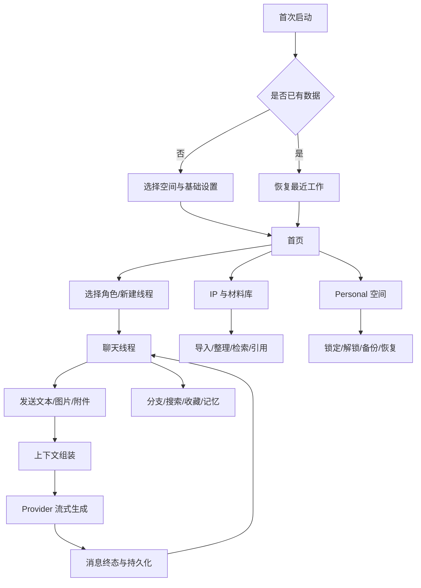
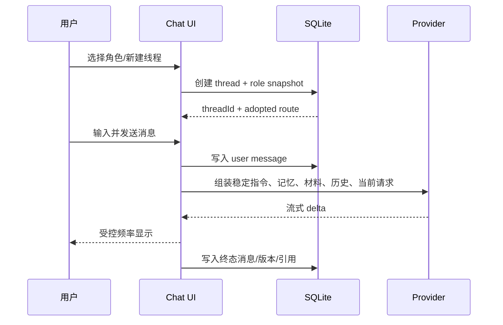
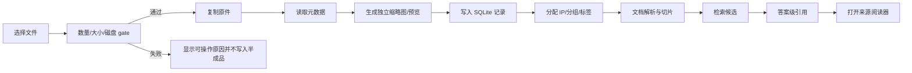
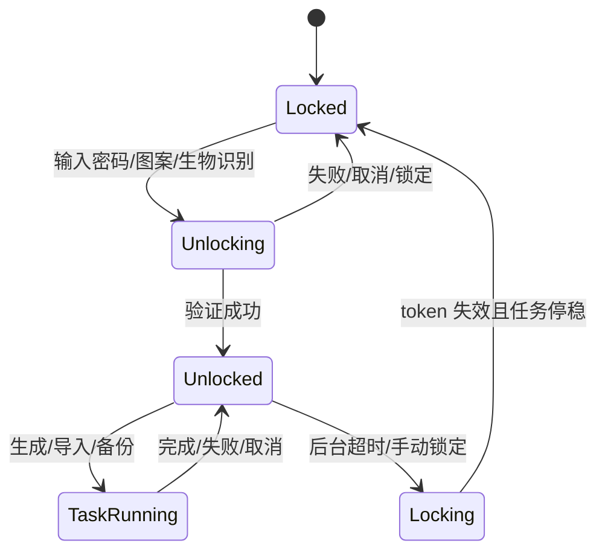

# Pixory 核心用户流程

> 适用版本：v2.8.5 稳定基线  
> 关联 PRD：[`产品PRD-Pixory-稳定版-v2.8.5.md`](./产品PRD-Pixory-稳定版-v2.8.5.md)

## 1. 流程总览

## 2. 首次启动与恢复

### 主流程

1. 应用初始化数据库空间、受管目录、版本与更新检查。
2. 如果没有线程，展示“开始一次有意义的对话”空状态，提供新建线程/选择角色入口。
3. 如果已有线程，恢复最近有效线程和 adopted route，不自动创建空线程。
4. 若存在未完成生成、导入、日记、梦境或恢复任务，显示可操作恢复状态。

### 异常与边界

- 数据库升级失败：停止进入业务页，记录可诊断错误，不重复执行迁移。
- Provider 未配置：允许浏览本地数据，发送时提示配置入口，不伪装成网络故障。
- Personal 锁定：只显示普通空间；不可预取 Personal 数据。

## 3. 创建角色并开始聊天

### 关键规则

- 线程必须绑定 `space + threadId + branch route`，任何入口都不得用“上次线程”兜底。
- 角色提示、首条问候、模型偏好以线程快照保存。
- 只有完成或明确停止的可见内容进入搜索、摘要和记忆；未显示队列不进入上下文。
- 生成中切换模式只影响下一轮；当前回合使用自己的 `modeSnapshot`。

## 4. 长对话、编辑与分支

1. 用户长按或操作历史消息。
2. 选择编辑、重新生成、继续、收藏或复制。
3. 编辑用户消息时，从该消息创建新的 message version 和 branch route。
4. 旧路径保留，新的 adopted route 指向新路径。
5. 分支树、历史列表、搜索、预取和聊天首屏全部读取同一 adopted route。
6. 切换分支后，记忆、材料、摘要和后续生成只使用当前路径。

### 失败恢复

- 分支切换期间发生刷新：丢弃过期 generation，重新读取持久化 route。
- 当前分支无可见消息：不显示为正常历史项，提供返回或删除操作。
- 旧路径仍可读但不应覆盖当前路径的消息列表。

## 5. 材料导入与 AI 引用

### 关键规则

- 原件只复制，不压缩、裁剪、重编码或覆盖。
- 导入失败必须清理本次新建文件，不能出现“数据库有记录但文件不存在”。
- 引用必须携带文档/材料版本；材料被删除或失效后，引用显示失效而不是静默换源。
- 文档流当前属于部分实现的能力，入口、来源更新和跨资料搜索不得在发布说明中夸大。

## 6. 记忆与陪伴产物

1. 用户完成一轮对话。
2. 本地规则生成 Companion Event 候选，记录证据跨度、分支和幂等键。
3. 记忆维护任务按作用域、置信度和用户设置筛选。
4. 日记/梦境/思绪任务冻结当前角色、分支、摘要和消息来源。
5. 生成完成后保存不可变来源锚点；失败可重试，取消可清理预留。
6. 只有用户确认纳入上下文的产物才进入下一轮，且标注低权限、非事实、非指令。

### 关键边界

- 无证据不得虚构；引用、否定、假设、玩笑和第三方转述不能直接形成高影响记忆。
- 线程删除、跨空间移动或分支切换后，旧来源必须重新校验。
- Personal 锁定会使任务令牌失效，任务只能在授权恢复后继续。

## 7. Personal 空间

### 操作规则

- 解锁只激活当前根分页，避免同时读取四个 Personal 页面。
- 锁定顺序：失效 task token → 等待生成/陪伴/记忆/日记/备份/导入任务停稳 → 关闭数据库 → 清理 Personal 内存与临时文件。
- 普通备份排除 Personal；Personal 备份必须经过验证。
- 跨空间移动前展示数据、角色、附件、记忆和原件风险；不允许 IP/知识库绑定线程静默错绑。

## 8. 备份与恢复

1. 用户选择普通、单 IP 或 Personal 备份。
2. 生成 Manifest V2，列出数据库、原件、缩略图、文档、附件、头像和相对路径。
3. 复制后复核文件大小和 SHA-256；缺失必需文件则整次失败。
4. 恢复时先解包和校验，再建立持久 ID 映射。
5. 按依赖顺序合并 SQLite；重写外键、JSON 引用、分支 scope 和文件 URI。
6. 重建 FTS，执行完整性检查。
7. 任一失败、取消或锁定时回滚数据库并清理本次新文件。

## 9. 发布、更新与支持

1. 版本变更先更新 PRD/故事/流程/功能矩阵和版本过程文档。
2. 执行 typecheck、test、diff check 和 Android 构建前文档预览。
3. `gradlew clean` 后构建 APK，复制到 `output/release/`。
4. 验签、设备安装/启动验证、官网部署、GitHub Release 和远程 JSON 校验。
5. 只有 APK 成功后归档当前版本过程文档，旧版本文件不可覆盖。
6. 发布后通过诊断、错误、用户反馈和指标决定下一补丁，而不是直接把实验能力写进稳定版本。

